<h1 align="center" id="title"></h1>

WellGood Coffee Roasters is an up-and-coming roastery that have approached me to create a website to showcase their brand and all they have to offer. It is their platform to sell their retail coffee, equipment as well as offer their customers a place to order their coffee just the way they like it.
Their mission is to get a more wide-spread client base, offering delivery to all of the UK.
They specialise in roasting limited edition retail bags of coffee, which works perfectly for their coffee fanatic customers who can choose their favourite coffee notes and get a new bag to try every time they purchase.
They want to inspire their customers to start their real coffee adventure, explore and find a new hobby in doing so, just like they have.

I have created this as my fourth milestone project for the Code Institute's Level 5 Diploma in Web Application Development.

[View the live project here.](https://wellgood-coffee-f56fcdb787d6.herokuapp.com/)

## Table of Contents

1. [User Experience (UX)](#user-experience-(UX))
2. [Features](#features)
3. [Deployment](#deployment)
4. [Technologies Used](#technologies-used)
5. [Code](#code)
6. [Credits](#credits)


## User Experience (UX) 

### User stories

<table>
  <thead>
    <tr>
      <th>As a...</th>
      <th>I want to be able to…</th>
      <th>So that I can…</th>
    </tr>
    <tr>
      <th colspan="3">Viewing and Navigation</th>
    </tr>
  </thead>
  <tbody>
    <tr>
      <td>Visitor</td>
      <td>Clearly identify the purpose of the site</td>
      <td>Determine whether the site is what I am searching for</td>
    </tr>
    <tr>
      <td>Shopper</td>
      <td>View a list of products</td>
      <td>Select some to purchase</td>
    </tr>
    <tr>
      <td>Shopper</td>
      <td>Take a coffee quiz</td>
      <td>To work out what sort of coffee would suit me best</td>
    </tr>
    <tr>
      <td>Shopper</td>
      <td>View individual product details</td>
      <td>To view the price, description, product rating, product image to check before potential purchase</td>
    </tr>
    <tr>
      <td>Shopper</td>
      <td>Easily view my basket total spend at any time</td>
      <td>Keep to my budget</td>
    </tr>
    <tr>
      <td>Shopper</td>
      <td>Easily view my postage total</td>
      <td>Keep to my budget and decide whether or not to spend more to meet the free postage threshold</td>
    </tr>
    </tbody>
    <thead>
    <tr>
      <th colspan="3">Registration and User Accounts</th>
    </tr>
    </thead>
    <tbody>
    <tr>
      <td>New visitor</td>
      <td>Register for an account</td>
      <td>To have all orders and profile information in one place for future purchases</td>
    </tr>
    <tr>
      <td>Registered User</td>
      <td>Login or logout</td>
      <td>Access my personal account information and previous purchases</td>
    </tr>
    <tr>
      <td>Registered User</td>
      <td>Reset my password in case I forget it</td>
      <td>Recover access to my account</td>
    </tr>
    <tr>
      <td>Registered User</td>
      <td>Receive an email confirmation after registering</td>
      <td>Verify that my account registration was successful</td>
    </tr>
    <tr>
      <td>Registered User</td>
      <td>Have a personalised user profile</td>
      <td>View my personal order history and order confirmation, and save my payment information</td>
    </tr>
    <tr>
      <td>Registered User</td>
      <td>Have my email address verified by the site</td>
      <td>Ensure my email address and personal data are safe and secure</td>
    </tr>
    <tr>
      <td>Registered User</td>
      <td>See my past order history</td>
      <td>Make repeat orders</td>
    </tr>
    </tbody>
    <thead>
    <tr>
      <th colspan="3">Sorting and Searching</th>
    </tr>
    </thead>
    <tbody>
    <tr>
      <td>Shopper</td>
      <td>Sort the list of available products</td>
      <td>Easily identify the best rated, best priced and categorically sorted products</td>
    </tr>
    <tr>
      <td>Shopper</td>
      <td>Sort a specific category of product</td>
      <td>Find the best priced or best rated product in a specific category, or sort the products in that category by name</td>
    </tr>
    <tr>
      <td>Shopper</td>
      <td>Sort multiple categories of products simultaneously</td>
      <td>Find all associated equipment linked to a word search</td>
    </tr>
    <tr>
      <td>Shopper</td>
      <td>Search for a product by name or description</td>
      <td>Find a specific product I would like to purchase</td>
    </tr>
    <tr>
      <td>Shopper</td>
      <td>Easily see what I've searched for and the number of results</td>
      <td>Quickly decide whether the product I want is available</td>
    </tr>
    <tr>
      <td>Shopper</td>
      <td>Save my billing and shipping details</td>
      <td>Checkout even quicker and more conveniently on future orders</td>
    </tr>
    </tbody>
    <thead>
    <tr>
      <th colspan="3">Purchasing and Checkout</th>
    </tr>
    </thead>
    <tbody>
    <tr>
      <td>Shopper</td>
      <td>Easily select the size, grind type and quantity of a coffee when purchasing it</td>
      <td>Ensure I don't accidentally select the wrong product, quantity, grind type or size</td>
    </tr>
    <tr>
      <td>Shopper</td>
      <td>View items in my bag to be purchased</td>
      <td>Identify the total cost of my purchase and all items I will receive</td>
    </tr>
    <tr>
      <td>Shopper</td>
      <td>View the total cost of my purchase before checking out</td>
      <td>So that I can see what the total cost of my purchase is including any additional costs such as shipping are before making my final purchase</td>
    </tr>
    <tr>
      <td>Shopper</td>
      <td>Adjust the quantity of individual items in my bag</td>
      <td>Easily make changes to my purchase before checkout</td>
    </tr>
        <tr>
      <td>Shopper</td>
      <td>Remove items in my bag</td>
      <td>Easily make changes to my purchase before checkout</td>
    </tr>
    <tr>
      <td>Shopper</td>
      <td>Easily enter my payment information</td>
      <td>Check out quickly with no hassles</td>
    </tr>
    <tr>
      <td>Shopper</td>
      <td>Feel my personal and payment information is safe and secure</td>
      <td>Confidently product the needed information to make a purchase</td>
    </tr>
    <tr>
      <td>Shopper</td>
      <td>View an order confirmation at checkout</td>
      <td>Verify that I haven't made any mistakes</td>
    </tr>
    <tr>
      <td>Shopper</td>
      <td>Receive an email confirmation after checking out</td>
      <td>Keep the confirmation of what I've purchase for my records</td>
    </tr>
    <tr>
      <td>Shopper</td>
      <td>Contact the store easily with any questions or concerns</td>
      <td>Get further information about a product or purchase</td>
    </tr>
    <tr>
      <td>Shopper</td>
      <td>See at a glance if there are any items in my shopping basket</td>
      <td>See quickly at a glance if there are any items already in my basket</td>
    </tr>
    <tr>
      <td>Shopper</td>
      <td>See how much I need to spend to qualify for free shipping</td>
      <td>Ensure I am getting the best value on potentially larger purchases</td>
    </tr>
    <tr>
      <td>Shopper</td>
      <td>Be able to checkout without registering for an account</td>
      <td>Checkout quickly and easily even if I don't want to register for an account with the store</td>
    </tr>
    </tbody>
    <thead>
    <tr>
      <th colspan="3">Admin and Store Management</th>
    </tr>
    </thead>
    <tbody>
    <tr>
      <td>Store Owner/Staff Member</td>
      <td>Add a product</td>
      <td>Add new items to my store</td>
    </tr>
    <tr>
      <td>Store Owner/Staff Member</td>
      <td>Edit/Update a product</td>
      <td>Change product prices, descriptions, images and other product criteria</td>
    </tr>
    <tr>
      <td>Store Owner/Staff Member</td>
      <td>Delete a product</td>
      <td>Remove items that are no longer for sale</td>
    </tr>
    <tr>
      <td>Store Owner/Staff Member</td>
      <td>Manage Stock levels</td>
      <td>Keep track of available inventory</td>
    </tr>
  </tbody>
</table>

### User Journey
I created UX flow charts using FigJam to map out the user stories.

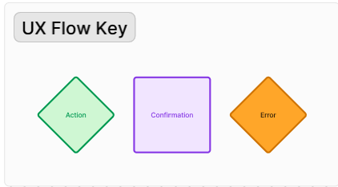

New visitor

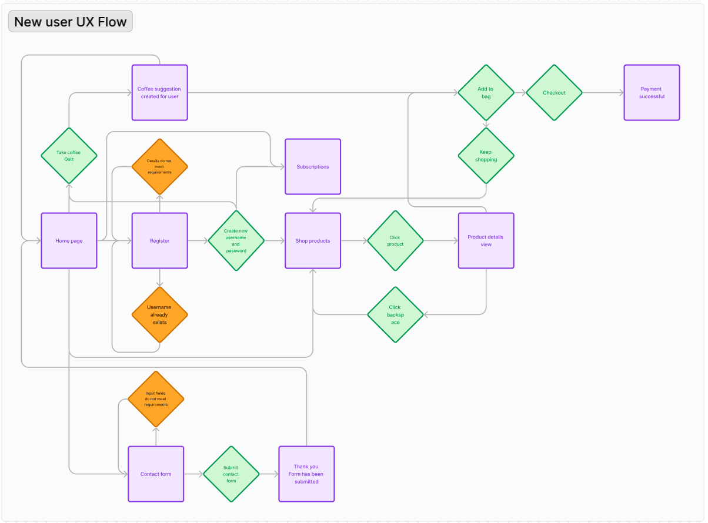

Returning and frequent visitor

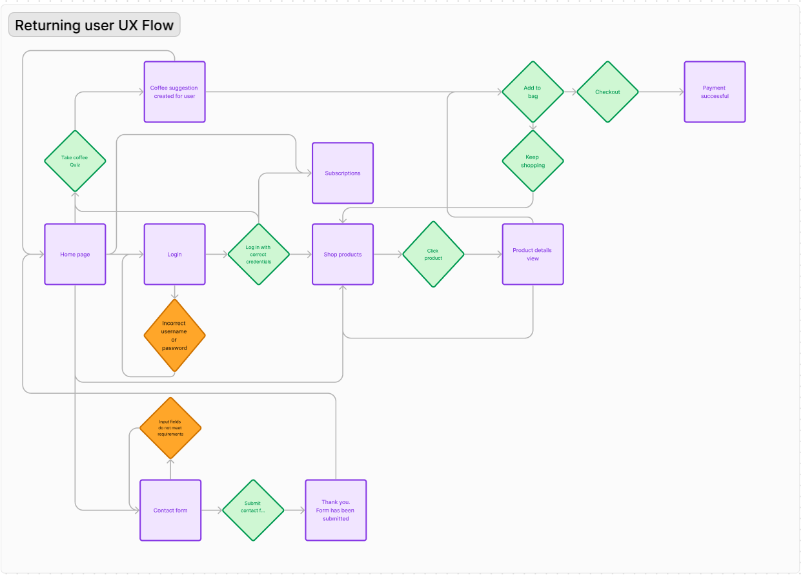

### Design

#### Colour Scheme
I used Coolor to choose a hipster-vibe colour palette for the site. Once chosen, I then checked colour combinations of the palette through the contrast checker to make sure the readability of my site was at a high standard and that I was followed good practices for accessibility.

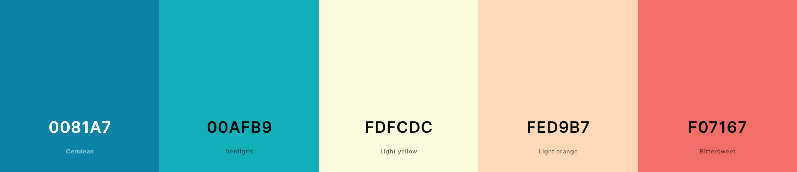


#### Colour Accessibility
			
I checked the contrast on any colour combinations I intended to use from my palette with [Coolor contrast checker](https://coolors.co/contrast-checker) to determine if they met the [WCAG AA guidelines](https://www.w3.org/TR/WCAG21/).

The dark blue and black and good readability. I tested the red to see if that would be acceptable for text use, but the contrast was not high enough so this along with the other colour in the colour palette will just be used for accents where needed.

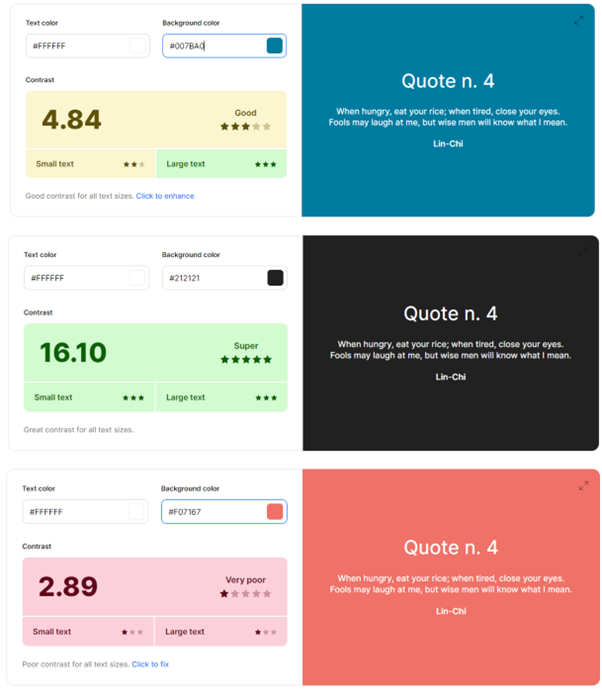

#### Typography
I chose a cursive font for titles, 'Playwrite IE' and 'Mulish' a simple sans-serif for the body text that is easy to read. I wanted to ensure I maintained good readability, which in turn will give an overall better user experience.

#### Imagery

  - ##### Logo
    I created the logo myself using the main title font 'Playwrite IE' and designing the logo in Adobe Illustrator.
    

  - ##### Background images
    I used two images for backgrounds on the home page and about page, which I sourced from [Pexels.com](pexels.com)


  - #### Product Images
    Equipment product images were also sourced from Pexels, all of the attributions for these images are in the below table. For the coffee bags I used a coffee bag mockup image from Freepik as well and edited to included my artwork in Photoshop.

  <table>
  <thead>
    <tr>
      <th>Product</th>
      <th>Image</th>
      <th>Attribution</th>
    </tr>
  </thead>
  <tbody>
    <tr>
      <td>Homepage background</td>
      <td></td>
      <td><a href="https://www.pexels.com/photo/two-cup-of-coffee-lattes-on-saucers-377903/">Image by Brigitte Tohm</a> on Pexels</td>
    </tr>
    <tr>
      <td>About page background</td>
      <td></td>
      <td><a href="https://www.pexels.com/photo/man-operating-a-machine-at-a-coffee-roasting-factory-4816478/">Image by Maksim Goncharenok</a> on Pexels</td>
    </tr>
    <tr>
      <td>Coffee icon on coffee bags</td>
      <td>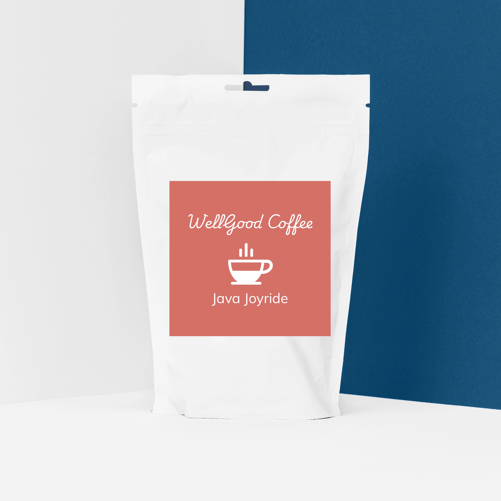</td>
      <td><a href="https://logowik.com/coffee-vector-icon-16731.html">Icon by Logowik</a> on Logowik</td>
    </tr>
    <tr>
      <td>Coffee Bag Mockup</td>
      <td></td>
      <td><a href="https://www.freepik.com/free-photo/white-plastic-tea-bag_3542875.htm#fromView=search&page=1&position=28&uuid=a4bb1b3b-8313-43fb-a456-eea4308b30a3">Image by Freepik</a> on Freepik</td>
    </tr>
    <tr>
      <td>Aeropress filter paper</td>
      <td></td>
      <td><a href="https://www.pexels.com/photo/crop-faceless-barista-pouring-hot-water-into-aeropress-coffee-maker-7421229/">Image by Marta Dzedyshko</a> on Pexels</td>
    </tr>
    <tr>
      <td>V60 Starter Kit</td>
      <td></td>
      <td><a href="https://www.pexels.com/photo/brewing-coffee-in-a-dripper-15672166/">Image by Onur Kaya</a> on Pexels</td>
    </tr>
    <tr>
      <td>Blend Coffee Bean Gift Set</td>
      <td></td>
      <td><a href="https://www.pexels.com/photo/pack-of-coffee-in-different-size-13741286/">Image by Dorukhan Pekcan</a> on Pexels</td>
    </tr>
    <tr>
      <td>Single Origin Coffee Bean Gift Set</td>
      <td></td>
      <td><a href="https://www.pexels.com/photo/coffee-in-bags-with-creative-design-13741281/">Image by Dorukhan Pekcan</a> on Pexels</td>
    </tr>
    <tr>
      <td>Aeropress Starter Kit</td>
      <td>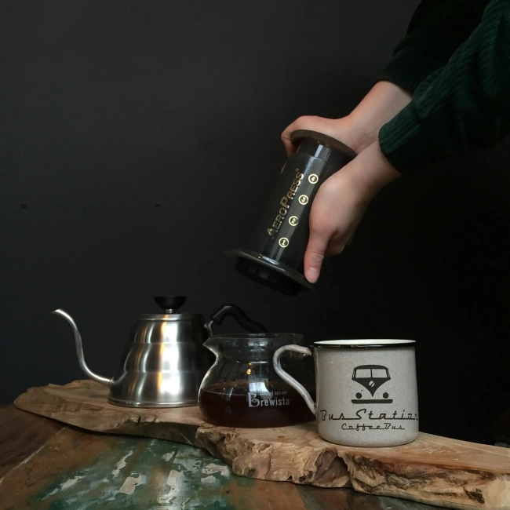</td>
      <td><a href="https://www.pexels.com/photo/person-about-to-put-aeropress-top-into-carafe-2074123/">Image by Viktoria Alipatova</a> on Pexels</td>
    </tr>
    <tr>
      <td>Grinder, Mug and Coffee Set</td>
      <td></td>
      <td><a href="https://www.pexels.com/photo/cup-with-mustache-and-beard-pattern-on-box-7488474/">Image by Karen Laårk Boshoff</a> on Pexels</td>
    </tr>
    <tr>
      <td>Manual Coffee Grinder</td>
      <td></td>
      <td><a href="https://www.pexels.com/photo/brown-coffee-grinder-beside-mug-362135/">Image by Mateusz Dach</a> on Pexels</td>
    </tr>

  </tbody>
</table>
<br>

I used icons from Font Awesome throughout the site [Font Awesome](https://fontawesome.com/).


### Wireframes

I used Figma and Balsamiq to plan and design my wireframes and user journey. I like using Figma in particular because it always you to brainstorm and keep all ideas and inspiration in one place as a singular visual to refer back to, which has been very useful throughout the project. I designed my web app in mobile format initially, before moving onto bigger screens, to ensure responsiveness was considered from the beginning, especially since most users will predominantly use their phones to access this app.

I had planned in an extra section for the site into the wireframes, which unfortunately I have not had enough scope to manage, which is a Suscribe & Save section, which would be a nice-to-have for future improvements to the site.

  - #### Mobile Wireframes

  


  - #### Tablet Wireframes

  

  - #### Laptop Wireframes

  

[Link to my Figma page](https://www.figma.com/design/IYOwfhepgdhys2z3s7EsUc/Milestone-4---WellGood-Coffee-Roasters?node-id=0-1&t=pPxFqoFWM4APLAXC-1)
  
### Database Schema
The database schema flow charts were created using [DrawSQL](https://drawsql.app/).

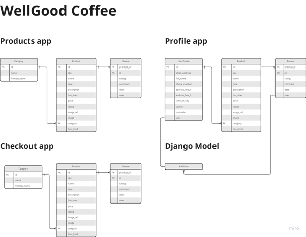


[Back to top](#title)  

## Features

### General

* My site is fully responsive and can be viewed and used effectively on all screen sizes down to 320px width by 480px height.
* I have considered readability contrast carefully for all visual elements.
* __Favicon__ - I have included a Favicon page tab icon to make the page look professional and consistent.


* __Reponsive Nav Bar__ - The navigation bar at the top of all the pages reduces to an accordion menu on tablet and mobile view for ease for use for the user. The options displayed on the nav bar are also dependent on whether a user is logged in or not, for an optimum user experience where options, such as 'Register' are no longer visible for logged in users. This keeps the pages clean and easier to navigate. I have included a search icon instead of a search bar on mobile and tablet versions, so the bar does not take up unnecessary space on the screen when not required.

* __Footer__ - #TBC Just like the nav bar, the links displayed in the footer are also dependent on whether a user is logged in or not, for an optimum user experience where options, such as 'Register' are no longer visible for logged in users. This keeps the pages clean and easier to navigate.

* __Logo__ - I created my simple text logo using the Playwrite IE font to keep a design consistency within the site.


* __Toast messages__ - At various actions, messages will flash at the top right of the page just below the nav bar to confirm to the user for instance, that a user account has been created, or a product has been added to the shopping bag. This gives the user a clear explanation of what has happened to avoid any unnecessary confusion.

## Landing page
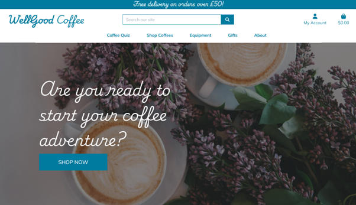

### Register page

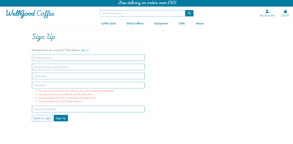

* __Registration form__ - This form submits a new username and password to the database and starts a session cookie, which triggers the 'Profile' page to be active. If a super user logs in, it activates the 'Product Management' page where the user can add products, and also makes 'edit' and 'delete' options visible on the product page annd product detail pages.

* __Password pattern required__ -  To make sure the user is creating strong passwords to keep their account secure, I have included an HTML5 regex pattern, so that the registration form will not submit unless the user has conformed to the requirements.

* __Requirement prompts__ -  So it is clear what patterns are required for passwords and usernames, I have included prompts should the user fill a field in incorrectly.

### Login page

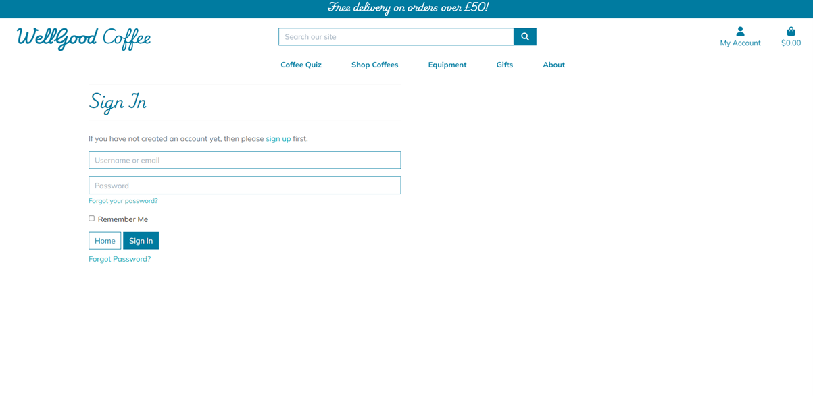

* __Login form__ - This form starts a session cookie, which triggers the 'Profile' to become visible and the 'Product Management' page if a super user has logged in.

* __Requirement prompts__ -  So it is clear what patterns are required for passwords and usernames, I have included prompts should the user fill a field in incorrectly.


### Search bar in navigation bar

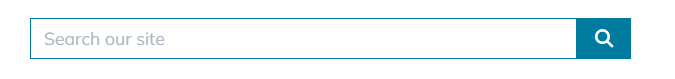

* __Search product names and descriptions__ - The search bar allows users to add search words that will be cross referenced across the whole database and bring up products that match the search in their name or description.

### Profile page

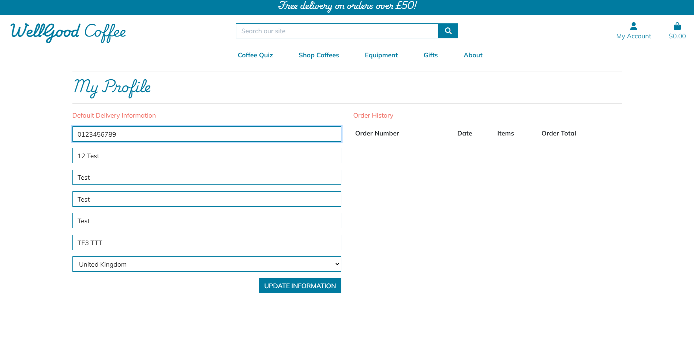

* __Default delivery information__ - This page allows the user to add their chosen default delivery information for future purchases.

* __Order history__ - The user can view their previous orders all in one place.

### Product Management page

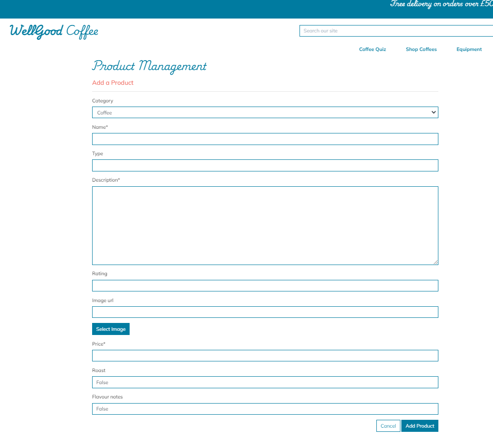

* __Add product__ - Allows super users to add products to the site with this form without them having to access the django admin board.

### Products page

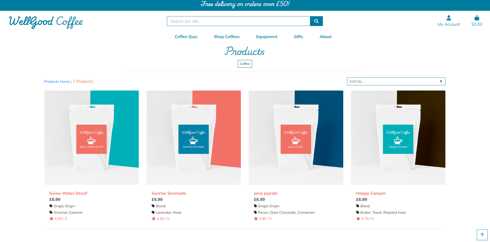

* __Coffee type tag__ - The Coffee type (Single Origin/Blend) will appear with the respective product if it is in the database. For coffee fanatics this is a key factor to consider when choosing coffee so felt it was important to highlight easily for the user.

* __Flavour notes tag__ - Similarly flavour notes are important when shoppers are considering what coffee to purchase so again, made sure this was visible on the product list pages for the users' ease. When products have a blank flavour note or type field in their variant, it is not set to visible on the product listing.

* __Review rating__ - Review ratings are visible for each product on the page.

* __Sort bar__ - The sort bar allows users to sort all the products on the page via name, price and rating, to again make it easier for them to tailor their shopping experience based on their requirements.

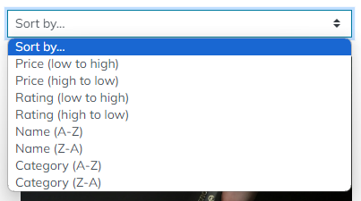

* __Edit and delete product buttons__ - The edit and delete buttons appear next to each product when a superuser is logged in so they can find and choose the product they wish to edit more easily than within the django admin panel.

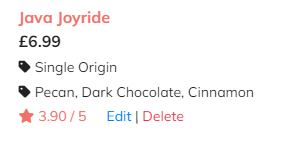

### Coffee Quiz


### Contact Form


* I have included a functional contact form created using emailjs for users to contact me.
* When a form is submitted, I receive an email with the user's message, name and email address included so I can respond to their query.
* All inputs are required.
* The contact form checks the input is valid before sending and if not it will alert the user - the email input will not work unless a proper email address is added, and you cannot leave any field blank.

## Thank you page


* A quick message to the user to confirm their message has been submitted and to redirect them back to the app page within 5 seconds.

## Error 404 page

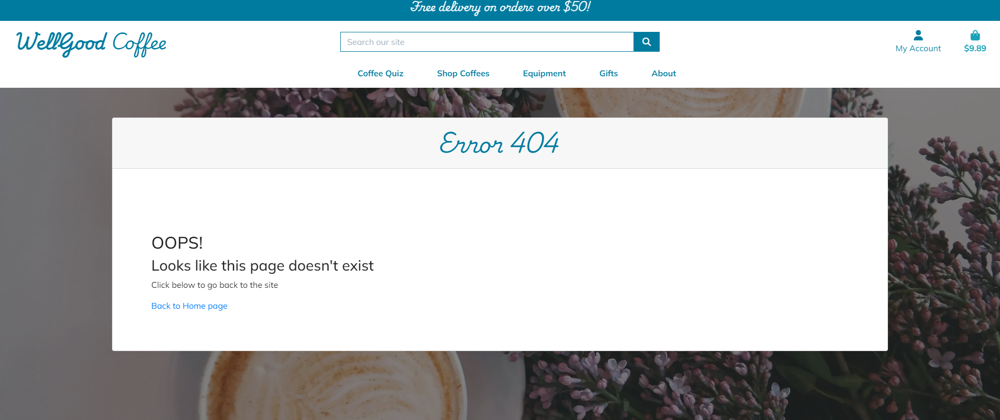

* Should any errors occur, the user will be directed to this page. I have included this page in the sendmail js file function, should the form not successfully submit. The page has a button that links back to the app page, so the user can return back to the main site easily and quickly.

## Possible Future Features

* __Recipe API__ - In future I would like to implement a recipe api, to give the user the opportunity to search through a much larger database of recipes, and give them the oppourtunity to add copies of recipes to their own digital cookbooks.
* __Shopping List__ - To provide the user with the ability to add items to their own digital shopping list.
* __Search Bar__ - To implement word search functionality so the user could search recipes using text rather than dropdowns. 

## Accessibility

I did the following to ensure good accessibility:
* Designed my app intuitively so it was easy to navigate around and create a positive user journey.
* Added aria labels to the links across the site to achieve a higher accessibility score.
* Used semantic HTML when building pages.
* Checked colour contrast against accessbility standards (mentions above in Colour Accessibility section)
* Added alt tags to all images.

## Media Queries

* I used Media Queries to debug and override some display issues that were not rectified with Materialize's responsive layouts.

# Deployment #

I used Heroku to deploy my site, coupled with ElephantSQL to host my relational database for free.

## ElephantSQL

1. From the [ElephantSQL](https://www.elephantsql.com/) homepage, you need to sign up for an account or log in.

2. Once logged in, you will be directed to the Instances page for your log in. You need to click on 'Create a new instance' in the top right hand corner.

3. Name your database, choose the 'Tiny Turtle' free plan, select the closest region to your location and then click the 'Create Instance' button and the bottom right corner of the page.

4. Then you will be able to see your new instance listed on your instances page. Click on your database name.

5. Within the database details, you will see a URL section -  copy the URL link and save for later during the Heroku deployment.

6. Finally, make sure in the '__init__.py' that you ad the if statement code snippet below. This ensures that SQLAlchemy can still read the external database.


## Heroku

1. Before navigating to the Heroku site to deploy, you need to make sure you have an up-to-date requirements.txt file and Procfile created in your repository. These will make sure Heroku knows all the required applications and their correct versions to deploy and function properly.

2. To create the requirements.txt file, use the following command in your terminal:

    "pip3 freeze --local > requirements.txt"

3. Similarly for the Procfile, use the following command in your terminal (make sure Procfile is capitalised. It does not need a file extension. The example below assumes the python file to launch your app is called 'run.py', so please change out if required):

    "echo web: python run.py > Procfile"

4. Check both files have been created properly. A couple of potential issues to be made a aware of:
* Make sure Procfile has the Heroku logo next to it in the file explorer view in your IDE
* Check that there are no blank lines at the end of the Procfile and delete them if found, as this can prevent it from deploying when being read by Heroku. Save, commit and push these files to your repository.

5. Login or register on the [Heroku](https://www.heroku.com) homepage.

6. Once on your dashboard, click the 'New' button and then 'Create new app' when it drops down.

7. Type in a unique app name, choose your region and click 'Create App'.

8. Now this has been created, we can now linke this to our repository in GitHub and our ElephantSQL database. Click on 'settings' heading in the app dashboard, then scroll down to click 'Reveal Config Vars'.

9. Add your config variables in this section for Heroku to build the app - these will be all the variables in your env.py file. It will look like this:

    | KEY | VALUE |
    | -- | -- |
    | DATABASE_URL | POSTGRES_DB_URL_FROM_ELEPHANT_SQL |
    | DEBUG | TRUE |
    | IP | 0.0.0.0 |
    | PORT | 5000 |
    | SECRET_KEY| YOUR_SECRET_KEY |

NOTES:
- The secret key value can be anything, but needs to be kept confidential.
- 'POSTGRES_DB_URL_FROM_ELEPHANT_SQL' - paste your ElephantSQL URL link in here.
- DEBUG set to TRUE is only for during the development phase, so make sure when deploying the finished app, to delete this variable.

10. Now the config variables are set up, go to the 'Deploy' heading. The quickest, easiest way to deploy is through selecting the 'Connect to GitHub' deployment method. Go through the login GitHub authentication steps.

11. Once your GitHub account is connected, select the respository you want to run in the 'Connect to GitHub' section.

12. For easier updating if you make changes to your repository, enable automatic deployment from GitHub.

13. Now you are ready to click the 'Deploy' button from the main branch. Heroku will now build your app.

14. Finally, we need to click on the 'More' button at the top of the dashboard screen and select 'Run Console' from the dropdown. This will set up the models in the ElephantSQL database. This is where we will set up the tables in the database we have created on ElephantSQL.

12. When the terminal loads, type the following, hitting enter at the end of each line:

    python3

    from recipes import db

    db.create_all()

    exit()

13. This has now created the relational database models from your repository into the ElephantSQL database. When you click on 'Open App' on the dashboard, it should now open Instacook.

### Forking the GitHub Repository

Forking allows users to make a copy of an original repository in GitHub and view and make changes to it without changing the original repository. To create a fork:
1. Once logged into GitHub, follow the link to your chosen GitHub repository, or use the search bar to find it on the GitHub home page.
2. Once in the repository window, click the 'Fork' drop down arrow button in the top right-hand corner.
3. Select 'Create new fork'.
4. Check the details in the window before clicking the green 'Create Fork' button.
5. You will now be able to find the copy of the repository in your own GitHub account.

### Making a Local Clone

1. Once logged into GitHub, follow the link to your chosen GitHub repository, or use the search bar to find it on the GitHub home page.
2. Once in the repository window, click the green 'Code' button.
3. To clone the repository using HTTPS, copy the link provided below the HTTPS header.
4. Open a terminal in your code editor.
5. Change the location in the current working directory to where you want the cloned directory to be created.
6. Type "git clone" into the terminal, and then paste the URL you copied and click enter.
7. This should have created a local clone of the repository.
8. Here is the live link to my website - https://instacook-64f0d9d64709.herokuapp.com/

# Testing #

I have documented my testing in a separate document [TESTING.md](TESTING.md)

# Technologies Used #

## Languages used
* HTML
* CSS
* Python
* Javascript

## Databases used
* PostgresSQL relational database

## Frameworks, Libraries & Programs Used
* [Am I Responsive](https://ui.dev/amiresponsive?url=https://instacook-64f0d9d64709.herokuapp.com) - To generate a screen mockup of my web app for this README.
* [Gitpod](https://gitpod.com) - To create, edit, preview and push my code to my GitHub repository.
* [Git](https://git-scm.com/) - For version control.
* [GitHub](Github.com) - To store versions of my site's repository while developing and then for deployment.
* [Heroku](heroku.com) - I deployed my project through Heroku.
* [Adobe Illustrator](https://www.adobe.com/uk/products/illustrator.html) - For designing the logo and favicon.
* [Balsamiq](https://balsamiq.com/) - For wireframes.
* [Miro](https://miro.com/) - To create my database schema.
* [Figma ad FigJam](figma.com) - Used as a design board to lay out my wireframes and keep a copy of my design thought process all in one place. I also used it to creat UX flow charts while planning my web app.
* [Adobe Photoshop](https://www.adobe.com/uk/products/photoshop.html) - Used for exporting any site images as .webp files to reduce file size and in turn improve the performance of my site.
* [EmailJS](https://www.emailjs.com/) - Used with my functional contact form that sends user messages to my inbox.
* [ElephantSQL](https://www.elephantsql.com/index.html) - Hosted my PostgresSQL database online.
* [Coolors](https://coolors.co/contrast-checker/112a46-acc8e5) - Contrast checker to test readability.
* [Materialize](https://materializecss.com/) - I used this CSS library for certain components in my web app.
* [Flask](https://flask.palletsprojects.com/en/2.3.x/) - The micro framework I used for my project.
* [Font Awesome](https://fontawesome.com/) - For all the icons in my web app.
* Google Dev Tools - Used to troubleshoot issues both front-end and back-end. It also includes Lighthouse which I used for testing.
* [Google Fonts](https://fonts.google.com/) - To import the fonts I chose for the website.
* [Jinja](https://jinja.palletsprojects.com/en/3.1.x/) - Templating engine
* [html5pattern](html5pattern.com) - The the HTML 5 regex pattern to make sure users create a secure password.
* [JSHint](https://jshint.com/) - To validate javaScript code.
* [SQLAlchemy](https://www.sqlalchemy.org/) - Database toolkit library for Python.
* [W3C](https://validator.w3.org/) - To validate and test HTML and CSS code.
* [Favicon](https://favicon.io/) - Generated my favicon files from the favicon I designed.

# Code

* **Thank-you page** - I used this code snippet to get the Thank You page to re-direct back to the site after 5 seconds. This was from a [Stack Overflow thread.](https://stackoverflow.com/questions/3292038/redirect-website-after-specified-amount-of-time)


* **Favicon** - I used a [Favicon generator](https://favicon.io/) to create the appropriate files for me to upload to my site, as well as this code snippet to install it site-wide.

* **Login functionality** - I used the Code Institute non relational database walkthrough to base my code on for the login and user creation functionality on the site, tailoring it where needed to fit into a relational database setting.

* **Materialize code** - I used a few materialize code snippets in my project:
    * Sidenav
    * Footer
    * Cards
    * Form
    * Dropdown selections
    * Collapsible
    * Modal pop-ups
    * Hero slider
I have annotated within my code where these site.

* **EmailJS** - I have annotated in my code where EmailJS API code appears for the contact form.

* **Recipe Ingredients and Instructions formatting** - Do add breaks into the instructions and ingredient lists of recipes, I used this solution to change '/n' to 'br' breaks for better readability: [Line Breaks Solutions](https://stackoverflow.com/questions/3206344/passing-html-to-template-using-flask-jinja2)

* **Dropdown Filters** - I used the following articles to help formulate the code for my dropdown filters on the search page:
    * [Query String Parameters](https://www.claravine.com/a-query-on-using-query-strings-parameters/) - reading through this gave me the idea to use this particular solution for this feature.
    * [Search Parameters](https://developer.mozilla.org/en-US/docs/Web/API/URL/searchParams) - reading on URL object and search params which I used in the JS snippets in my script.js file.
    * [SQLAlchemy filters](https://www.tutorialspoint.com/sqlalchemy/sqlalchemy_orm_filter_operators.htm) - how to apply filters with SQLAlchemy.
    * [Update a query string parameter](https://stackoverflow.com/a/68499745) - I used the solution below to help form the JS function.
    
    

* **Dropdown validation bug fix** - Initially, if dropdowns on Add and edit recipe pages not selected, no validation message was appearing. Upon inspection of the dropdowns in Google Dev Tools I spotted that Materialize adds a "Display:none" to dropdowns, which removes the usual validation messages. I searched for a solution and found this 'select' code snippet [Dropdown solution](https://stackoverflow.com/questions/34248898/how-to-validate-select-option-for-a-materialize-dropdown ) to remove the materialize CSS on it, so that the validation would show again.

# Credits

* Code Institute relational database walkthrough helped me work out how to create and best approach creating this project.
* Google fonts for ['Pacifico' typography.](https://fonts.google.com/specimen/Pacifico) and ['Poppins' typography.](https://fonts.google.com/specimen/Poppins)
* Logo and favicon I designed myself.
* Images in the hero slider are from [Pexels](pexels.com):
    * https://www.pexels.com/photo/steak-food-769289/
    * https://www.pexels.com/photo/vegetable-salad-3026808/
    * https://www.pexels.com/photo/ice-cream-on-bowl-beside-spoon-1343504/
    * https://www.pexels.com/photo/assorted-salads-on-bowls-1640773/
* To populate some example recipes, I used some recipes from the [BBC Good Food website](https://www.bbcgoodfood.com/recipes).


### Thanks

* Martina Terlevic my CI mentor, for her encouragement and advice.
* Liz Curtis my friend and fellow coder, for patiently listening, giving encouragement and brainstorming with me when I was troubleshooting.
* The big and little human beings of the Ulloa-James household who have been very patient with me, allowing me the time day or night to get my coding done.


### Future Features

Given additioanl time and resource some future features that I would like to encorporate into this project are...

- The abilitiy to sign up and sign in using social accounts such as google or facebook.
- To restric reviews so that a personal can only review a product that they have previously purchased
- For the user to be able to store favourite products or a wishlist
- Product recommendations based on previous purchases and also other similar user profiles
- Abdandoned cart recovery
- A loyalty program
- A feature where users can request notification emails when their favourite products come back into stock

### Accessibility
-   The use of semantic HTML.
-   Ensuring the colours and text use meet accessibility standards set by [w3.org](https://www.w3.org/TR/WCAG21/).
-   Ensuring all clickable buttons and links are tabbable using the keyboard.
-   Using descriptive alt tags on all images.
-   Using correct aria labels where necessary.
-   Being mindful in the creation of the design to ensure it is intuitive and as easy to navigate as possible.

### Development Process
As well as using [Figma](https://www.figma.com/) to create wireframes and flow charts for this project, I also used Figma's Kanban template to keep track of tasks as I found the "sticky note" style more user friendly and it suited my style of task management better.

You can view the Kanban board [here](https://www.figma.com/file/rspHu8qzVH35mFzarGLARC/Keto-Kreations-Kanban?type=whiteboard&node-id=0%3A1&t=CzMSWuqP3I3DBtYb-1).


[Back to top](#title)  

## Technologies Used

### Languages Used
-   HTML
-   CSS
-   Vanilla javaScript
-   Python


### Databases Used
-   sqlite3 in development - A relational database
-   PostgreSQL via ElephantSQL in production - A relational database

### Frameworks, Libraries & Programs Used

-   [Amazon AWS](https://aws.amazon.com/) - For static file storage
-   [Bootstrap](https://getbootstrap.com/) - Version 5.3.0 - For the layout and framework of the website, it was also used to create the various modals which were then restyled to match the rest of the website.
-   [Boto3](https://boto3.amazonaws.com/v1/documentation/api/latest/index.html) - For AWS implementation
-   [Cloud Convert](https://cloudconvert.com/) - To compress and convert images to webp.
-   [Code Institute PEP8 Python Linter](https://pep8ci.herokuapp.com/) - To check for linting errors in my python code.
-   [Coolors](https://coolors.co/) - To check contrast and accessibility of the colours I chose to use.
-   [ElephantSQL](https://www.elephantsql.com/) - To host my PostgreSQL database
-   [Figma](https://www.figma.com/) - To create the wireframes, user journey flow chart and database schema flow chart as well as the Kanban feature to manage the development process.
-   [dj-database-url](https://pypi.org/project/dj-database-url/) - So that I can use databse URLs in Django
-   [Django](https://www.djangoproject.com/) - An open source python web framework
-   [Django Crispy Forms](https://django-crispy-forms.readthedocs.io/en/latest/) - For Django form styling
-   [Font Awesome](https://fontawesome.com/) - Used for the GitHub icon used in the footer button.
-   [Figma](https://www.figma.com/) - For my wireframes, database schema diagram and also as a Kanban board for project management
-   [Git](https://git-scm.com/) - For version control.
-   [GitHub](https://github.com/) - To store website files and repository for the website.
-   [Google Dev Tools](https://developer.chrome.com/docs/devtools) - Built into the chrome browser to test features and design and to troubleshoot as I went along as well as for testing later on using tools such a Lighthouse.
-   [Google Fonts](https://fonts.google.com/) - To import the fonts I chose for the website.
-   [Gmail](https://mail.google.com/) - As my email hosting provider
-   [Gunicorn](https://gunicorn.org/) - As a HTTP server within my Heroku app
-   [Heroku](https://www.heroku.com/) - To host my application
-   [JSHint](https://jshint.com/) - To validate and test javaScript code.
-   [Mini Webtool](https://miniwebtool.com/django-secret-key-generator/) - To generate a secret key for Django
-   [Pillow](https://pillow.readthedocs.io/en/stable/) - For image processing in Django 
-   [Psycopg2](https://pypi.org/project/psycopg2/) - To more easily manage my PostgrSQL databse using Python
-   [Siege Media](https://www.siegemedia.com/contrast-ratio) - To check contrast and accessibility of the `rgba` colours I chose to use.
-   [Stripe](https://stripe.com/gb) - For payment processing
-   Lighthouse - Built into Google Dev Tools for testing.
-   [SQLAlchemy](https://www.sqlalchemy.org/) - Database abstraction library, used to interact with PostgreSQL.
-   [VS Code](https://code.visualstudio.com/) - Was used as my code editor to write code, version control using git and pushing changes for storage to GitHub.
-   [Website Mockup Generator](https://websitemockupgenerator.com/) - To create the website mockup images at the top of the README.
-   [W3C](https://www.w3.org/) - To validate and test HTML and CSS code.


[Back to top](#title)  

## Testing

Please see [TESTING.md](TESTING.md) for all testing performed


## Deployment

The project was deployed to [Heroku](https://www.heroku.com/) using a free relational database from [ElephantSQL](https://www.elephantsql.com/). Before deploying to Heroku I would first set up the database so I will explain the deployment in 2 two parts.

### ElephantSQL

1. Navigate to [ElephantSQL.com](https://www.elephantsql.com/) and click “Get a managed database today”

2. Select “Try now for FREE” in the TINY TURTLE database plan.

3. Select “Log in with GitHub” and authorize ElephantSQL with your selected GitHub account.

4. In the Create new team form:
    - Add a team name (your own name is fine)
    - Read and agree to the Terms of Service
    - Select Yes for GDPR
    - Provide your email address
    - Click “Create Team”

5. Your account should now be successfully created.

6. Click “Create New Instance”.

7. Set up your plan:
    - Give your plan a Name (this is commonly the name of the project)
    - Select the Tiny Turtle (Free) plan
    - You can leave the Tags field blank

8. Select a data centre closest to you - I used EU-West-1 (Ireland).

9. Click "Review".

10. Check your details are correct and then click “Create instance”.

11. Your database should now be successfully created.

12. Return to the ElephantSQL dashboard and click on the database instance name for this project.

13. In the URL section, clicking the copy icon will copy the database URL to your clipboard. Keep this tab open as we will need this URL later.

### Heroku

1. To successfully deploy on Heroku we first to install some dependencies to that you can use Postgres on your deployed site. 

    ```bash
    pip3 install dj_database_url
    pip3 install psycopg2
    ```

2. We then need to create some files: a requirements.txt file and a Procfile.

3. The requirements.txt file contains all the applications and dependencies that are required to run the app. To create the requirements.txt file run the following command in the terminal:

    ```bash
    pip3 freeze --local > requirements.txt
    ```

4. The Procfile tells Heroku which files run the app and how to run it. To create the Procfile run the following command in the terminal:

    ```bash
     web: gunicorn [your app name].wsgi:application
    ```

5. If the Procfile has been created correctly it will have the Heroku logo next to it. It is also important to check the Procfile contents, as sometimes on creation a blank line will be added at the end of the file. This can sometimes cause problems when deploying to Heroku, so if the file contains a blank line at the end, delete this and save the file. Make sure to save both these files and then add, commit and push them to GitHub.

6. Login (or sign up) to [Heroku.com](https://www.heroku.com).

7. Click the new button and then click create new app.

8. You will then be asked to give your app a name (these must be unique) and select a region. Once these are completed click create app.

9. You will now need to connect the Heroku app to the GitHub repository for the site. Select GitHub in the deployment section, find the correct repository for the project and then click connect.

10. Once the repository is connected, you will need to provide Heroku some config variables it needs to build the app. Click on the settings tab and then click reveal config vars button. You will now need to add the environment key/value variables some of which were used in the env.py file and some of which will be different:

    | KEY | VALUE |
    | -- | -- |
    | AWS_ACCESS_KEY_ID | `your variable here if you have it already` |
    | AWS_SECRET_ACCESS_KEY | `your variable here if you have it already` |
    | DISABLE_COLLECTSTATIC | 1* |
    | DATABASE_URL | `your variable here`** |
    | EMAIL_HOST_PASS | `your variable here` |
    | EMAIL_HOST_USER | `your variable here` |
    | SECRET_KEY | `your variable here` |
    | STRIPE_PUBLIC_KEY | `your variable here` |
    | STRIPE_SECRET_KEY | `your variable here` |
    | STRIPE_WH_SECRET | `your variable here` |
    | USE_AWS | True |
    | DEVELOPMENT | True*** |

    *This is temporary and will be removed later.

    **This is where we paste our URL from step 13 in ElephantSQL section.

    ***This variable is to be deleted once debugging is complete and you are ready to deploy your "production" app.

11. You then need to add the hostname of your Heroku app to settings.py which can be found in the Heroku settings tab under Domains.

    ```bash
    ALLOWED_HOSTS = ['keto-kreations-25ff0a2cbc9e.herokuapp.com', 'localhost']
    ```

12. We now need to migrate our database to our ElephantSQL databse. Go to the top right hand of Heroku and select, more then select Run console. Type bash and click Run then type the following commands.

    ```bash
    python3 manage.py makemigrations --dry-run
    python3 manage.py makemigrations
    python3 manage.py migrate --plan
    python3 manage.py migrate
    ```
    
13. Assuming all your migrations were completed succesfully you can now create your superuser by running the below command and filling in your details.

      ```bash
      python3 manage.py createsuperuser    
      ```

14. Now that the relational database has been set up and the tables created and superuser created, we can now click open app and the application should now open in a new tab. If you haven't set up your AWS yet your CSS and images wont have loaded yet. We will set that up next.

### Amazon AWS

  #### Setting up an S3 Bucket
  1. Create an [Amazon AWS](aws.amazon.com) account

  2. Search for **S3** and create a new bucket
      - Allow public access
      - Acknowledge

  3. Under **Properties > Static** website hosting
      - Enable
      - `index.html` as index document
      - Save

  4. Under **Permissions > CORS** use:
      ```bash
          [
        {
            "AllowedHeaders": [
                "Authorization"
            ],
            "AllowedMethods": [
                "GET"
            ],
            "AllowedOrigins": [
                "*"
            ],
            "ExposeHeaders": []
        }
      ]
      ```

  5. Under **Permissions > Bucket Policy**:
      - Generate Bucket Policy and take note of **Bucket ARN**
      - Chose **S3 Bucket Policy** as Type of Policy
      - For **Principal**, enter `*`
      - Enter **ARN** noted above
      - **Add Statement**
      - **Generate Policy**
      - Copy **Policy JSON Document**
      - Paste policy into **Edit Bucket policy** on the previous tab
      - Save changes

  6. Under **Access Control List (ACL)**:
      - For **Everyone (public access)**, tick **List**
      - Accept that everyone in the world may access the Bucket
      - Save changes

  #### Setting up AWS IAM
  1. From the **IAM dashboard** within AWS, select **User Groups**:
      - Create new group e.g. `manage-keto-kreations`
      - Click through without adding a policy
      - **Create Group**

  2. Select **Policies**:
      - Create policy
      - Under **JSON** tab, click **Import managed policy**
      - Choose **AmazongS3FullAccess**
      - Edit the resource to include the **Bucket ARN** noted earlier when creating the Bucket Policy:

      ```bash
            "Resource": [
                            "arn:aws:s3:::keto-kreations",
                            "arn:aws:s3:::keto-kreations/*"
                  ]
      ```

      - Click **next step** and go to **Review policy**
      - Give the policy a name e.g. `keto-kreations-policy` and description
      - **Create policy**

  3. Go back to **User Groups** and choose the group created earlier
      - Under **Permissions > Add permissions**, choose **Attach Policies** and select the one just created
      - **Add permissions**

  4. Under **Users**:
      - Choose a user name e.g. `keto-kreations-staticfiles-user`
      - Select **Programmatic access** as the **Access type**
      - Click Next
      - Add the user to the Group just created
      - Click Next and **Create User**

  5. **Download the `.csv` containing the access key and secret access key. This will NOT be available to download again**

  #### Hooking Django up to S3

  1. Install boto3 and django-storages
      ```bash
      pip3 install boto3
      pip3 install django-storages
      pip3 freeze > requirements.txt
      ```

  2. Add the values from the `.csv` you downloaded to your Heroku Config Vars under Settings:
      ```bash
      AWS_ACCESS_KEY_ID
      AWS_SECRET_ACCESS_KEY
      ```

  3. Delete the `DISABLE_COLLECTSTATIC` variable from your Config Vars and deploy your Heroku app, if you have enabled automatic deployment in Heroku this will happen automatically the next push you make to GitHub

  4. With your S3 bucket now set up, you can create a new folder called `media` (at the same level as the newly added `static` folder) and upload any required media files to it, making sure they are publicly accessible under **Permissions**


### Forking the GitHub Repository

By forking the GitHub Repository we make a copy of the original repository on our GitHub account to view and/or make changes without affecting the original repository by using the following steps...

1. Login to GitHub.
2. Locate the repository, you can use a link you have been provided with or use the search function in the top left of the screen.
3. In the top right hand corner of the page locate and click the 'fork' button.
4. Near the bottom of the page click the green button that says 'Create Fork'.
5. You should now have a copy of the original repository in your GitHub account.

### Making a Local Clone

1. Login to GitHub.
2. Locate the repository, you can use a link you have been provided with or use the search function in the top left of the screen.
3. Near the top of the repository click the green 'Code' button.
4. To clone the repository using HTTPS, under HTTPS copy the link provided.
5. Open the terminal in your code editor. 
6. Change the current working directory to the location where you want the cloned directory to be made.
7. Type git clone, and then paste the URL you copied in Step 3.
8. Press Enter. Your local clone should be created.
9. To install all the required dependencies you just need to run the following...
    ```bash
    pip3 install -r requirements.txt
    ```

[Back to top](#title)  

## Credits

### Code

-   Social Media Integration for Facebook, LinkedIn & Google - Code from [Abi Harrison Meta Tags Webinar](https://www.youtube.com/watch?v=t-4qqmikIqk).

All other small code snippets used are referenced in the code as a comment.

All other code was written by the developer.

### Content

-   Ingredients, allergens, product descriptions and nutritional information is made up data using ChatGPT
-   All other static content for this website was written by the developer.
 

### Media

-   Logo - The logo was created using [Logo.com](https://logo.com/)

### Acknowledgements

I 100% couldn't have completed this project on my own so would like to acknowledge the following people for their contributions, whether they know they helped or not...

-   My Fiancé and children for their unwavering support.
-   [Iris Smok](https://github.com/Iris-Smok) my cohort facilitator for her support and for checking in on me when I have had to take some time away from the keyboard.
-   [Martina Terlevic](https://github.com/SephTheOverwitch) for her advice and support.
-   The [Code Institute](https://codeinstitute.net/) student support for checking in on me when it seems I might have gone MIA.
-   The people on my cohort for their support, encouragement and for reviewing my project.

[Back to top](#title)  