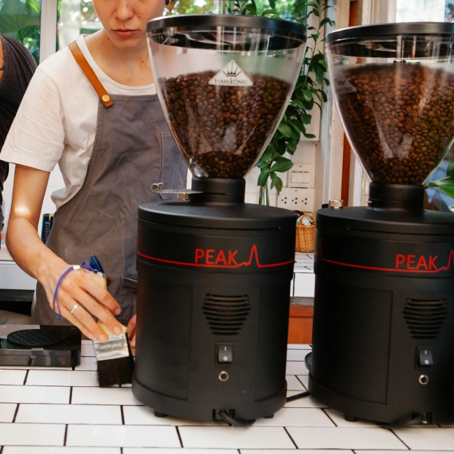
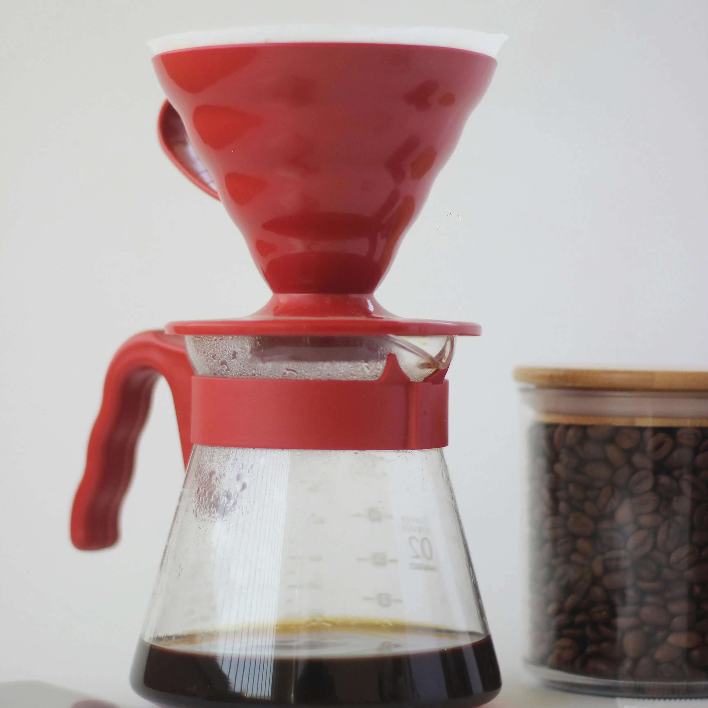
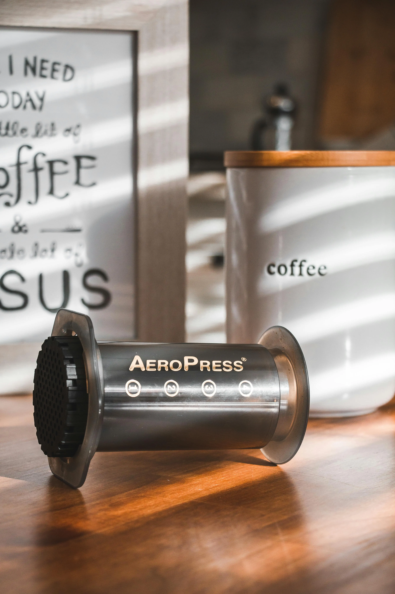

<h1 align="center" id="title"></h1>

WellGood Coffee Roasters is an up-and-coming roastery that have approached me to create a website to showcase their brand and all they have to offer. It is their platform to sell their retail coffee, equipment as well as offer their customers a place to order their coffee just the way they like it.
Their mission is to get a more wide-spread client base, offering delivery to all of the UK.
They specialise in roasting limited edition retail bags of coffee, which works perfectly for their coffee fanatic customers who can choose their favourite coffee notes and get a new bag to try every time they purchase.
They want to inspire their customers to start their real coffee adventure, explore and find a new hobby in doing so, just like they have.

I have created this as my fourth milestone project for the Code Institute's Level 5 Diploma in Web Application Development.

[View the live project here.](https://wellgood-coffee-f56fcdb787d6.herokuapp.com/)

## Table of Contents

1. [User Experience (UX)](#user-experience-(UX))
2. [Features](#features)
3. [Deployment](#deployment)
4. [Technologies Used](#technologies-used)
5. [Code](#code)
6. [Credits](#credits)


## User Experience (UX) 

### User stories

<table>
  <thead>
    <tr>
      <th>As a...</th>
      <th>I want to be able to…</th>
      <th>So that I can…</th>
    </tr>
    <tr>
      <th colspan="3">Viewing and Navigation</th>
    </tr>
  </thead>
  <tbody>
    <tr>
      <td>Visitor</td>
      <td>Clearly identify the purpose of the site</td>
      <td>Determine whether the site is what I am searching for</td>
    </tr>
    <tr>
      <td>Shopper</td>
      <td>View a list of products</td>
      <td>Select some to purchase</td>
    </tr>
    <tr>
      <td>Shopper</td>
      <td>Take a coffee quiz</td>
      <td>To work out what sort of coffee would suit me best</td>
    </tr>
    <tr>
      <td>Shopper</td>
      <td>View individual product details</td>
      <td>To view the price, description, product rating, product image to check before potential purchase</td>
    </tr>
    <tr>
      <td>Shopper</td>
      <td>Easily view my basket total spend at any time</td>
      <td>Keep to my budget</td>
    </tr>
    <tr>
      <td>Shopper</td>
      <td>Easily view my postage total</td>
      <td>Keep to my budget and decide whether or not to spend more to meet the free postage threshold</td>
    </tr>
    </tbody>
    <thead>
    <tr>
      <th colspan="3">Registration and User Accounts</th>
    </tr>
    </thead>
    <tbody>
    <tr>
      <td>New visitor</td>
      <td>Register for an account</td>
      <td>To have all orders and profile information in one place for future purchases</td>
    </tr>
    <tr>
      <td>Registered User</td>
      <td>Login or logout</td>
      <td>Access my personal account information and previous purchases</td>
    </tr>
    <tr>
      <td>Registered User</td>
      <td>Reset my password in case I forget it</td>
      <td>Recover access to my account</td>
    </tr>
    <tr>
      <td>Registered User</td>
      <td>Receive an email confirmation after registering</td>
      <td>Verify that my account registration was successful</td>
    </tr>
    <tr>
      <td>Registered User</td>
      <td>Have a personalised user profile</td>
      <td>View my personal order history and order confirmation, and save my payment information</td>
    </tr>
    <tr>
      <td>Registered User</td>
      <td>Have my email address verified by the site</td>
      <td>Ensure my email address and personal data are safe and secure</td>
    </tr>
    <tr>
      <td>Registered User</td>
      <td>See my past order history</td>
      <td>Make repeat orders</td>
    </tr>
    </tbody>
    <thead>
    <tr>
      <th colspan="3">Sorting and Searching</th>
    </tr>
    </thead>
    <tbody>
    <tr>
      <td>Shopper</td>
      <td>Sort the list of available products</td>
      <td>Easily identify the best rated, best priced and categorically sorted products</td>
    </tr>
    <tr>
      <td>Shopper</td>
      <td>Sort a specific category of product</td>
      <td>Find the best priced or best rated product in a specific category, or sort the products in that category by name</td>
    </tr>
    <tr>
      <td>Shopper</td>
      <td>Sort multiple categories of products simultaneously</td>
      <td>Find all associated equipment linked to a word search</td>
    </tr>
    <tr>
      <td>Shopper</td>
      <td>Search for a product by name or description</td>
      <td>Find a specific product I would like to purchase</td>
    </tr>
    <tr>
      <td>Shopper</td>
      <td>Easily see what I've searched for and the number of results</td>
      <td>Quickly decide whether the product I want is available</td>
    </tr>
    <tr>
      <td>Shopper</td>
      <td>Save my billing and shipping details</td>
      <td>Checkout even quicker and more conveniently on future orders</td>
    </tr>
    </tbody>
    <thead>
    <tr>
      <th colspan="3">Purchasing and Checkout</th>
    </tr>
    </thead>
    <tbody>
    <tr>
      <td>Shopper</td>
      <td>Easily select the size, grind type and quantity of a coffee when purchasing it</td>
      <td>Ensure I don't accidentally select the wrong product, quantity, grind type or size</td>
    </tr>
    <tr>
      <td>Shopper</td>
      <td>View items in my bag to be purchased</td>
      <td>Identify the total cost of my purchase and all items I will receive</td>
    </tr>
    <tr>
      <td>Shopper</td>
      <td>View the total cost of my purchase before checking out</td>
      <td>So that I can see what the total cost of my purchase is including any additional costs such as shipping are before making my final purchase</td>
    </tr>
    <tr>
      <td>Shopper</td>
      <td>Adjust the quantity of individual items in my bag</td>
      <td>Easily make changes to my purchase before checkout</td>
    </tr>
        <tr>
      <td>Shopper</td>
      <td>Remove items in my bag</td>
      <td>Easily make changes to my purchase before checkout</td>
    </tr>
    <tr>
      <td>Shopper</td>
      <td>Easily enter my payment information</td>
      <td>Check out quickly with no hassles</td>
    </tr>
    <tr>
      <td>Shopper</td>
      <td>Feel my personal and payment information is safe and secure</td>
      <td>Confidently product the needed information to make a purchase</td>
    </tr>
    <tr>
      <td>Shopper</td>
      <td>View an order confirmation at checkout</td>
      <td>Verify that I haven't made any mistakes</td>
    </tr>
    <tr>
      <td>Shopper</td>
      <td>Receive an email confirmation after checking out</td>
      <td>Keep the confirmation of what I've purchase for my records</td>
    </tr>
    <tr>
      <td>Shopper</td>
      <td>Contact the store easily with any questions or concerns</td>
      <td>Get further information about a product or purchase</td>
    </tr>
    <tr>
      <td>Shopper</td>
      <td>See at a glance if there are any items in my shopping basket</td>
      <td>See quickly at a glance if there are any items already in my basket</td>
    </tr>
    <tr>
      <td>Shopper</td>
      <td>See how much I need to spend to qualify for free shipping</td>
      <td>Ensure I am getting the best value on potentially larger purchases</td>
    </tr>
    <tr>
      <td>Shopper</td>
      <td>Be able to checkout without registering for an account</td>
      <td>Checkout quickly and easily even if I don't want to register for an account with the store</td>
    </tr>
    </tbody>
    <thead>
    <tr>
      <th colspan="3">Admin and Store Management</th>
    </tr>
    </thead>
    <tbody>
    <tr>
      <td>Store Owner/Staff Member</td>
      <td>Add a product</td>
      <td>Add new items to my store</td>
    </tr>
    <tr>
      <td>Store Owner/Staff Member</td>
      <td>Edit/Update a product</td>
      <td>Change product prices, descriptions, images and other product criteria</td>
    </tr>
    <tr>
      <td>Store Owner/Staff Member</td>
      <td>Delete a product</td>
      <td>Remove items that are no longer for sale</td>
    </tr>
    <tr>
      <td>Store Owner/Staff Member</td>
      <td>Manage Stock levels</td>
      <td>Keep track of available inventory</td>
    </tr>
  </tbody>
</table>

### User Journey
I created UX flow charts using FigJam to map out the user stories.


New visitor


Returning and frequent visitor


### Design

#### Colour Scheme
I used Coolor to choose a hipster-vibe colour palette for the site. Once chosen, I then checked colour combinations of the palette through the contrast checker to make sure the readability of my site was at a high standard and that I was followed good practices for accessibility.


#### Colour Accessibility
			
I checked the contrast on any colour combinations I intended to use from my palette with [Coolor contrast checker](https://coolors.co/contrast-checker) to determine if they met the [WCAG AA guidelines](https://www.w3.org/TR/WCAG21/).

The dark blue and black and good readability. I tested the red to see if that would be acceptable for text use, but the contrast was not high enough so this along with the other colour in the colour palette will just be used for accents where needed.


#### Typography
I chose a cursive font for titles, 'Playwrite IE' and 'Mulish' a simple sans-serif for the body text that is easy to read. I wanted to ensure I maintained good readability, which in turn will give an overall better user experience.

#### Imagery

  - ##### Logo
    I created the logo myself using the main title font 'Playwrite IE' and designing the logo in Adobe Illustrator.
    

  - ##### Background images
    I used two images for backgrounds on the home page and about page, which I sourced from [Pexels.com](pexels.com)


  - #### Product Images
    Equipment product images were also sourced from Pexels, all of the attributions for these images are in the below table. For the coffee bags I used a coffee bag mockup image from Freepik as well and edited to included my artwork in Photoshop.

  <table>
  <thead>
    <tr>
      <th>Product</th>
      <th>Image</th>
      <th>Attribution</th>
    </tr>
  </thead>
  <tbody>
    <tr>
      <td>Homepage background</td>
      <td></td>
      <td><a href="https://www.pexels.com/photo/two-cup-of-coffee-lattes-on-saucers-377903/">Image by Brigitte Tohm</a> on Pexels</td>
    </tr>
    <tr>
      <td>About page background</td>
      <td></td>
      <td><a href="https://www.pexels.com/photo/man-operating-a-machine-at-a-coffee-roasting-factory-4816478/">Image by Maksim Goncharenok</a> on Pexels</td>
    </tr>
    <tr>
      <td>Coffee Bag Mockup</td>
      <td></td>
      <td><a href="https://www.freepik.com/free-photo/white-plastic-tea-bag_3542875.htm#fromView=search&page=1&position=28&uuid=a4bb1b3b-8313-43fb-a456-eea4308b30a3">Image by Freepik</a> on Freepik</td>
    </tr>
    <tr>
      <td>Aeropress filter paper</td>
      <td></td>
      <td><a href="https://www.pexels.com/photo/crop-faceless-barista-pouring-hot-water-into-aeropress-coffee-maker-7421229/">Image by Marta Dzedyshko</a> on Pexels</td>
    </tr>
    <tr>
      <td>V60 Starter Kit</td>
      <td></td>
      <td><a href="https://www.pexels.com/photo/brewing-coffee-in-a-dripper-15672166/">Image by Onur Kaya</a> on Pexels</td>
    </tr>
    <tr>
      <td>Blend Coffee Bean Gift Set</td>
      <td></td>
      <td><a href="https://www.pexels.com/photo/pack-of-coffee-in-different-size-13741286/">Image by Dorukhan Pekcan</a> on Pexels</td>
    </tr>
    <tr>
      <td>Single Origin Coffee Bean Gift Set</td>
      <td></td>
      <td><a href="https://www.pexels.com/photo/coffee-in-bags-with-creative-design-13741281/">Image by Dorukhan Pekcan</a> on Pexels</td>
    </tr>
    <tr>
      <td>Aeropress Starter Kit</td>
      <td></td>
      <td><a href="https://www.pexels.com/photo/person-about-to-put-aeropress-top-into-carafe-2074123/">Image by Viktoria Alipatova</a> on Pexels</td>
    </tr>
    <tr>
      <td>Grinder, Mug and Coffee Set</td>
      <td></td>
      <td><a href="https://www.pexels.com/photo/cup-with-mustache-and-beard-pattern-on-box-7488474/">Image by Karen Laårk Boshoff</a> on Pexels</td>
    </tr>
    <tr>
      <td>Manual Coffee Grinder</td>
      <td></td>
      <td><a href="https://www.pexels.com/photo/brown-coffee-grinder-beside-mug-362135/">Image by Mateusz Dach</a> on Pexels</td>
    </tr>
    <tr>
      <td>Electric Coffee Grinder</td>
      <td></td>
      <td><a href="https://www.pexels.com/photo/crop-cafe-employees-with-coffee-grinders-and-machines-at-work-6205608/">Image by Tim Douglas</a> on Pexels</td>
    </tr>
    <tr>
      <td>V60 Plastic Dripper</td>
      <td></td>
      <td><a href="https://www.pexels.com/photo/red-and-clear-glass-coffee-dripper-8211266/">Image by Arun Thomas</a> on Pexels</td>
    </tr>
    <tr>
      <td>Aeropress</td>
      <td></td>
      <td><a href="https://www.pexels.com/photo/black-coffee-press-on-wooden-table-3993825/">Image by Juan Gomez</a> on Pexels</td>
    </tr>
  </tbody>
</table>
<br>

All other imagery on the website are basic icons obtained from Font Awesome which can be found [here](https://fontawesome.com/).


### Wireframes
The wireframes were creates using [Figma](https://www.figma.com/). I have deviated somewhat from my original wireframes, but this was mainly design preference and ensuring a good responsive layout on smaller screens.

I did not create separate wireframes for mobile and tablet as the layout is identical.

  - #### Mobile Wireframes

  


  - #### Tablet Wireframes

  

[Link to my Figma page](https://www.figma.com/design/IYOwfhepgdhys2z3s7EsUc/Milestone-4---WellGood-Coffee-Roasters?node-id=0-1&t=pPxFqoFWM4APLAXC-1)
  
### Database Schema
The database schema flow charts were created using [Miro](https://www.miro.com/).


[Back to top](#title)  

## Features

- Fully responsive across all screen sizes.

<table>
    <thead>
        <tr>
            <th colspan="2">Desktop</th>
        </tr>
    </thead>
    <tbody>
        <tr>
            <td>Welcome page</td>
            <td></td>
        </tr>
        <tr>
            <td>Products page</td>
            <td></td>
        </tr>
        <tr>
            <td>Product details page</td>
            <td></td>
        </tr>
        <tr>
            <td>Product details page</td>
            <td></td>
        </tr>
        <tr>
            <td>Shopping bag page</td>
            <td></td>
        </tr>
        <tr>
            <td>Checkout page</td>
            <td></td>
        </tr>
        <tr>
            <td>Checkout page</td>
            <td></td>
        </tr>
        <tr>
            <td>Checkout success page</td>
            <td></td>
        </tr>
        <tr>
            <td>Profile page</td>
            <td></td>
        </tr>
        <tr>
            <td>Profile page</td>
            <td></td>
        </tr>
        <tr>
            <td>Product management page</td>
            <td></td>
        </tr>
        <tr>
            <td>Add product page</td>
            <td></td>
        </tr>
        <tr>
            <td>Add product page</td>
            <td></td>
        </tr>
        <tr>
            <td>Add variant page</td>
            <td></td>
        </tr>
        <tr>
            <td>Edit product page</td>
            <td></td>
        </tr>
        <tr>
            <td>Edit product page</td>
            <td></td>
        </tr>
        <tr>
            <td>Edit variant page</td>
            <td></td>
        </tr>
        <tr>
            <td>Product management modal</td>
            <td></td>
        </tr>
        <tr>
            <td>Product management modal</td>
            <td></td>
        </tr>
        <tr>
            <td>Stock management page</td>
            <td></td>
        </tr>
        <tr>
            <td>Login page</td>
            <td>
            </td>
        </tr>
        <tr>
            <td>Logout page</td>
            <td></td>
        </tr>
        <tr>
            <td>Register page</td>
            <td></td>
        </tr>
    </tbody>
    <thead>
        <tr>
            <th colspan="2">Tablet</th>
        </tr>
    </thead>
    <tbody>
        <tr>
            <td>Welcome page</td>
            <td></td>
        </tr>
        <tr>
            <td>Products page</td>
            <td></td>
        </tr>
        <tr>
            <td>Product details page</td>
            <td></td>
        </tr>
        <tr>
            <td>Product details page</td>
            <td></td>
        </tr>
        <tr>
            <td>Shopping bag page</td>
            <td></td>
        </tr>
        <tr>
            <td>Checkout page</td>
            <td></td>
        </tr>
        <tr>
            <td>Checkout page</td>
            <td></td>
        </tr>
        <tr>
            <td>Checkout success page</td>
            <td></td>
        </tr>
        <tr>
            <td>Profile page</td>
            <td></td>
        </tr>
        <tr>
            <td>Profile page</td>
            <td></td>
        </tr>
        <tr>
            <td>Profile page</td>
            <td></td>
        </tr>
        <tr>
            <td>Product management page</td>
            <td></td>
        </tr>
        <tr>
            <td>Product management page</td>
            <td></td>
        </tr>
        <tr>
            <td>Add product page</td>
            <td></td>
        </tr>
        <tr>
            <td>Add product page</td>
            <td></td>
        </tr>
        <tr>
            <td>Add variant page</td>
            <td></td>
        </tr>
        <tr>
            <td>Add variant page</td>
            <td></td>
        </tr>
        <tr>
            <td>Edit product page</td>
            <td></td>
        </tr>
        <tr>
            <td>Edit product page</td>
            <td></td>
        </tr>
        <tr>
            <td>Edit variant page</td>
            <td></td>
        </tr>
        <tr>
            <td>Edit variant page</td>
            <td></td>
        </tr>
        <tr>
            <td>Product management modal</td>
            <td></td>
        </tr>
        <tr>
            <td>Product management modal</td>
            <td></td>
        </tr>
        <tr>
            <td>Stock management page</td>
            <td></td>
        </tr>
        <tr>
            <td>Stock management page</td>
            <td></td>
        </tr>
        <tr>
            <td>Login page</td>
            <td>
            </td>
        </tr>
        <tr>
            <td>Logout page</td>
            <td>
            </td>
        </tr>
        <tr>
            <td>Register page</td>
            <td></td>
        </tr>
        <tr>
            <td>Sidenav</td>
            <td>
            </td>
        </tr>
    </tbody>
    <thead>
        <tr>
            <th colspan="2">Mobile</th>
        </tr>
    </thead>
    <tbody>
        <tr>
            <td>Welcome page</td>
            <td></td>
        </tr>
        <tr>
            <td>Products page</td>
            <td></td>
        </tr>
        <tr>
            <td>Products page</td>
            <td></td>
        </tr>
        <tr>
            <td>Product details page</td>
            <td></td>
        </tr>
        <tr>
            <td>Product details page</td>
            <td></td>
        </tr>
        <tr>
            <td>Shopping bag page</td>
            <td></td>
        </tr>
        <tr>
            <td>Shopping bag page</td>
            <td></td>
        </tr>
        <tr>
            <td>Checkout page</td>
            <td></td>
        </tr>
        <tr>
            <td>Checkout page</td>
            <td></td>
        </tr>
        <tr>
            <td>Checkout success page</td>
            <td></td>
        </tr>
        <tr>
            <td>Checkout success page</td>
            <td></td>
        </tr>
        <tr>
            <td>Profile page</td>
            <td></td>
        </tr>
        <tr>
            <td>Profile page</td>
            <td></td>
        </tr>
        <tr>
            <td>Profile page</td>
            <td></td>
        </tr>
        <tr>
            <td>Product management page</td>
            <td></td>
        </tr>
        <tr>
            <td>Product management page</td>
            <td></td>
        </tr>
        <tr>
            <td>Add product page</td>
            <td></td>
        </tr>
        <tr>
            <td>Add product page</td>
            <td></td>
        </tr>
        <tr>
            <td>Add variant page</td>
            <td></td>
        </tr>
        <tr>
            <td>Add variant page</td>
            <td></td>
        </tr>
        <tr>
            <td>Edit product page</td>
            <td></td>
        </tr>
        <tr>
            <td>Edit product page</td>
            <td></td>
        </tr>
        <tr>
            <td>Edit variant page</td>
            <td></td>
        </tr>
        <tr>
            <td>Edit variant page</td>
            <td></td>
        </tr>
        <tr>
            <td>Product management modal</td>
            <td></td>
        </tr>
        <tr>
            <td>Product management modal</td>
            <td></td>
        </tr>
        <tr>
            <td>Stock management page</td>
            <td></td>
        </tr>
        <tr>
            <td>Stock management page</td>
            <td></td>
        </tr>
        <tr>
            <td>Login page</td>
            <td>
            </td>
        </tr>
        <tr>
            <td>Logout page</td>
            <td>
            </td>
        </tr>
        <tr>
            <td>Register page</td>
            <td></td>
        </tr>
        <tr>
            <td>Sidenav</td>
            <td>
            </td>
        </tr>
    </tbody>
</table>

<hr>

- Intuitive and easy to navigate using the top navbar on larger screens and sidenav on smaller screens which present different options to the user depending on whether or not they are logged in, and if they are a 'super user' as well as if there are products currently in their shopping bag. 

	There is also a search function allowing the customer to search for the exact products they need .There are also various appropriately marked buttons throughout the site making navigation easy.

  
  
  
  
<hr>

- Full account management including the ability to...
	- Sign in
	- Sign out
	- Sign up
	- Reset forgotten passwords

	The main functionality for account management is provided by AllAuth built into Django but the pages have been restyled to fit in with the page design and be fully responsive.

  
  
  
  
<hr>

- A homepage designed to convey straight away exactly what the site is about to the user.

  
<hr>

- A contact button which is always visible in the navbar or sidenav, giving users a quick and convenient way to contact the store with any queries.

  
  
<hr>

- A product page offering basic product information and pictures as well as various filtering and sorting options allowing the user to easily navigate the products available in the store. 

  
  

<hr>

- Conveniently placed badges and tags on products giving instant feedback to the user as to whether a product is new, on sale or out of stock as well as which category it belongs to.

  
  
<hr>

- A product details page giving more in depth information about the product such as the description, stock availability, reviews, ingredients, allergens and nutritional information.

	It also shows any reviews that have been left for the product as well as giving registered users the ability to leave their own reviews.

  
  
<hr>

- A product selector on each product page where the product has different variants such as different package sizes, which also shows how many of each variant is currently in stock for purchase. When selected the price on the page is dynamically updated.

  
<hr>

- The ability to store items in the shopping bag for purchase as well as the ability to update the quantity required or remove them all together.

  
  
  
<hr>

- The ability to add available discount codes to your order.

  
<hr>

- A secure checkout page powered by Stripe payments which shows a summary of the order and also give the user the ability to save their details for future orders if they are already registered.

  
  
  
  
<hr>

- A checkout success page with give confirmation of the current order as well as a summary of the order.

  
<hr>

- A user profile page which give users the ability to view and update their default delivery information, as well as an order history section, giving the user the ability to view details of all their past orders. 

  There is also a reviews section which give the user the ability to see the past reviews as well as being able to edit or delete those reviews.
  
  
  
<hr>

- For super users the is a product management section which provides the ability to do the following...
		- Add, edit and delete products and product variants
		- Add, edit and delete discount codes
		- Manage the stock levels of the store

    
<hr>

- Custom success, warning and error messages giving customers feedback on their actions as they navigate the site, as well as a preview of their shopping carts when changes are made to their current 'bag items'.

    
    
    
<hr>

- Confirmation emails sent for all orders made as well as when the custom makes contact with the store via the 'Contact' modal on the site.

  
  
  
  
  
  
<hr>

- A custom 404 page that informs the user the page they are looking for hasn't been found with a button directing them back to the homepage.

    
<hr>

- A back to top button on the products page which only appears when the customer begins scrolling down.

  
<hr>

- Defensive programming has been used throughout the development of the application, to prompt users when they are either about to permanently delete something that cannot be done such as a product or discount code, as well as to stop users accessing pages they aren't authorised to access, for instance any page that requires a user to be logged in or for a user to be a super user.

  
  

<hr>

- An intuitive stock management system which checks stock values before allowing a user to place an order in case someone else has made an order since they added the product to their cart, as well updating the stock counts dynamically as and when orders are placed.

  

<hr>


### Future Features

Given additioanl time and resource some future features that I would like to encorporate into this project are...

- The abilitiy to sign up and sign in using social accounts such as google or facebook.
- To restric reviews so that a personal can only review a product that they have previously purchased
- For the user to be able to store favourite products or a wishlist
- Product recommendations based on previous purchases and also other similar user profiles
- Abdandoned cart recovery
- A loyalty program
- A feature where users can request notification emails when their favourite products come back into stock

### Accessibility
-   The use of semantic HTML.
-   Ensuring the colours and text use meet accessibility standards set by [w3.org](https://www.w3.org/TR/WCAG21/).
-   Ensuring all clickable buttons and links are tabbable using the keyboard.
-   Using descriptive alt tags on all images.
-   Using correct aria labels where necessary.
-   Being mindful in the creation of the design to ensure it is intuitive and as easy to navigate as possible.

### Development Process
As well as using [Figma](https://www.figma.com/) to create wireframes and flow charts for this project, I also used Figma's Kanban template to keep track of tasks as I found the "sticky note" style more user friendly and it suited my style of task management better.

You can view the Kanban board [here](https://www.figma.com/file/rspHu8qzVH35mFzarGLARC/Keto-Kreations-Kanban?type=whiteboard&node-id=0%3A1&t=CzMSWuqP3I3DBtYb-1).


[Back to top](#title)  

## Technologies Used

### Languages Used
-   HTML
-   CSS
-   Vanilla javaScript
-   Python


### Databases Used
-   sqlite3 in development - A relational database
-   PostgreSQL via ElephantSQL in production - A relational database

### Frameworks, Libraries & Programs Used

-   [Amazon AWS](https://aws.amazon.com/) - For static file storage
-   [Bootstrap](https://getbootstrap.com/) - Version 5.3.0 - For the layout and framework of the website, it was also used to create the various modals which were then restyled to match the rest of the website.
-   [Boto3](https://boto3.amazonaws.com/v1/documentation/api/latest/index.html) - For AWS implementation
-   [Cloud Convert](https://cloudconvert.com/) - To compress and convert images to webp.
-   [Code Institute PEP8 Python Linter](https://pep8ci.herokuapp.com/) - To check for linting errors in my python code.
-   [Coolors](https://coolors.co/) - To check contrast and accessibility of the colours I chose to use.
-   [ElephantSQL](https://www.elephantsql.com/) - To host my PostgreSQL database
-   [Figma](https://www.figma.com/) - To create the wireframes, user journey flow chart and database schema flow chart as well as the Kanban feature to manage the development process.
-   [dj-database-url](https://pypi.org/project/dj-database-url/) - So that I can use databse URLs in Django
-   [Django](https://www.djangoproject.com/) - An open source python web framework
-   [Django Crispy Forms](https://django-crispy-forms.readthedocs.io/en/latest/) - For Django form styling
-   [Font Awesome](https://fontawesome.com/) - Used for the GitHub icon used in the footer button.
-   [Figma](https://www.figma.com/) - For my wireframes, database schema diagram and also as a Kanban board for project management
-   [Git](https://git-scm.com/) - For version control.
-   [GitHub](https://github.com/) - To store website files and repository for the website.
-   [Google Dev Tools](https://developer.chrome.com/docs/devtools) - Built into the chrome browser to test features and design and to troubleshoot as I went along as well as for testing later on using tools such a Lighthouse.
-   [Google Fonts](https://fonts.google.com/) - To import the fonts I chose for the website.
-   [Gmail](https://mail.google.com/) - As my email hosting provider
-   [Gunicorn](https://gunicorn.org/) - As a HTTP server within my Heroku app
-   [Heroku](https://www.heroku.com/) - To host my application
-   [JSHint](https://jshint.com/) - To validate and test javaScript code.
-   [Mini Webtool](https://miniwebtool.com/django-secret-key-generator/) - To generate a secret key for Django
-   [Pillow](https://pillow.readthedocs.io/en/stable/) - For image processing in Django 
-   [Psycopg2](https://pypi.org/project/psycopg2/) - To more easily manage my PostgrSQL databse using Python
-   [Siege Media](https://www.siegemedia.com/contrast-ratio) - To check contrast and accessibility of the `rgba` colours I chose to use.
-   [Stripe](https://stripe.com/gb) - For payment processing
-   Lighthouse - Built into Google Dev Tools for testing.
-   [SQLAlchemy](https://www.sqlalchemy.org/) - Database abstraction library, used to interact with PostgreSQL.
-   [VS Code](https://code.visualstudio.com/) - Was used as my code editor to write code, version control using git and pushing changes for storage to GitHub.
-   [Website Mockup Generator](https://websitemockupgenerator.com/) - To create the website mockup images at the top of the README.
-   [W3C](https://www.w3.org/) - To validate and test HTML and CSS code.


[Back to top](#title)  

## Testing

Please see [TESTING.md](TESTING.md) for all testing performed


## Deployment

The project was deployed to [Heroku](https://www.heroku.com/) using a free relational database from [ElephantSQL](https://www.elephantsql.com/). Before deploying to Heroku I would first set up the database so I will explain the deployment in 2 two parts.

### ElephantSQL

1. Navigate to [ElephantSQL.com](https://www.elephantsql.com/) and click “Get a managed database today”

2. Select “Try now for FREE” in the TINY TURTLE database plan.

3. Select “Log in with GitHub” and authorize ElephantSQL with your selected GitHub account.

4. In the Create new team form:
    - Add a team name (your own name is fine)
    - Read and agree to the Terms of Service
    - Select Yes for GDPR
    - Provide your email address
    - Click “Create Team”

5. Your account should now be successfully created.

6. Click “Create New Instance”.

7. Set up your plan:
    - Give your plan a Name (this is commonly the name of the project)
    - Select the Tiny Turtle (Free) plan
    - You can leave the Tags field blank

8. Select a data centre closest to you - I used EU-West-1 (Ireland).

9. Click "Review".

10. Check your details are correct and then click “Create instance”.

11. Your database should now be successfully created.

12. Return to the ElephantSQL dashboard and click on the database instance name for this project.

13. In the URL section, clicking the copy icon will copy the database URL to your clipboard. Keep this tab open as we will need this URL later.

### Heroku

1. To successfully deploy on Heroku we first to install some dependencies to that you can use Postgres on your deployed site. 

    ```bash
    pip3 install dj_database_url
    pip3 install psycopg2
    ```

2. We then need to create some files: a requirements.txt file and a Procfile.

3. The requirements.txt file contains all the applications and dependencies that are required to run the app. To create the requirements.txt file run the following command in the terminal:

    ```bash
    pip3 freeze --local > requirements.txt
    ```

4. The Procfile tells Heroku which files run the app and how to run it. To create the Procfile run the following command in the terminal:

    ```bash
     web: gunicorn [your app name].wsgi:application
    ```

5. If the Procfile has been created correctly it will have the Heroku logo next to it. It is also important to check the Procfile contents, as sometimes on creation a blank line will be added at the end of the file. This can sometimes cause problems when deploying to Heroku, so if the file contains a blank line at the end, delete this and save the file. Make sure to save both these files and then add, commit and push them to GitHub.

6. Login (or sign up) to [Heroku.com](https://www.heroku.com).

7. Click the new button and then click create new app.

8. You will then be asked to give your app a name (these must be unique) and select a region. Once these are completed click create app.

9. You will now need to connect the Heroku app to the GitHub repository for the site. Select GitHub in the deployment section, find the correct repository for the project and then click connect.

10. Once the repository is connected, you will need to provide Heroku some config variables it needs to build the app. Click on the settings tab and then click reveal config vars button. You will now need to add the environment key/value variables some of which were used in the env.py file and some of which will be different:

    | KEY | VALUE |
    | -- | -- |
    | AWS_ACCESS_KEY_ID | `your variable here if you have it already` |
    | AWS_SECRET_ACCESS_KEY | `your variable here if you have it already` |
    | DISABLE_COLLECTSTATIC | 1* |
    | DATABASE_URL | `your variable here`** |
    | EMAIL_HOST_PASS | `your variable here` |
    | EMAIL_HOST_USER | `your variable here` |
    | SECRET_KEY | `your variable here` |
    | STRIPE_PUBLIC_KEY | `your variable here` |
    | STRIPE_SECRET_KEY | `your variable here` |
    | STRIPE_WH_SECRET | `your variable here` |
    | USE_AWS | True |
    | DEVELOPMENT | True*** |

    *This is temporary and will be removed later.

    **This is where we paste our URL from step 13 in ElephantSQL section.

    ***This variable is to be deleted once debugging is complete and you are ready to deploy your "production" app.

11. You then need to add the hostname of your Heroku app to settings.py which can be found in the Heroku settings tab under Domains.

    ```bash
    ALLOWED_HOSTS = ['keto-kreations-25ff0a2cbc9e.herokuapp.com', 'localhost']
    ```

12. We now need to migrate our database to our ElephantSQL databse. Go to the top right hand of Heroku and select, more then select Run console. Type bash and click Run then type the following commands.

    ```bash
    python3 manage.py makemigrations --dry-run
    python3 manage.py makemigrations
    python3 manage.py migrate --plan
    python3 manage.py migrate
    ```
    
13. Assuming all your migrations were completed succesfully you can now create your superuser by running the below command and filling in your details.

      ```bash
      python3 manage.py createsuperuser    
      ```

14. Now that the relational database has been set up and the tables created and superuser created, we can now click open app and the application should now open in a new tab. If you haven't set up your AWS yet your CSS and images wont have loaded yet. We will set that up next.

### Amazon AWS

  #### Setting up an S3 Bucket
  1. Create an [Amazon AWS](aws.amazon.com) account

  2. Search for **S3** and create a new bucket
      - Allow public access
      - Acknowledge

  3. Under **Properties > Static** website hosting
      - Enable
      - `index.html` as index document
      - Save

  4. Under **Permissions > CORS** use:
      ```bash
          [
        {
            "AllowedHeaders": [
                "Authorization"
            ],
            "AllowedMethods": [
                "GET"
            ],
            "AllowedOrigins": [
                "*"
            ],
            "ExposeHeaders": []
        }
      ]
      ```

  5. Under **Permissions > Bucket Policy**:
      - Generate Bucket Policy and take note of **Bucket ARN**
      - Chose **S3 Bucket Policy** as Type of Policy
      - For **Principal**, enter `*`
      - Enter **ARN** noted above
      - **Add Statement**
      - **Generate Policy**
      - Copy **Policy JSON Document**
      - Paste policy into **Edit Bucket policy** on the previous tab
      - Save changes

  6. Under **Access Control List (ACL)**:
      - For **Everyone (public access)**, tick **List**
      - Accept that everyone in the world may access the Bucket
      - Save changes

  #### Setting up AWS IAM
  1. From the **IAM dashboard** within AWS, select **User Groups**:
      - Create new group e.g. `manage-keto-kreations`
      - Click through without adding a policy
      - **Create Group**

  2. Select **Policies**:
      - Create policy
      - Under **JSON** tab, click **Import managed policy**
      - Choose **AmazongS3FullAccess**
      - Edit the resource to include the **Bucket ARN** noted earlier when creating the Bucket Policy:

      ```bash
            "Resource": [
                            "arn:aws:s3:::keto-kreations",
                            "arn:aws:s3:::keto-kreations/*"
                  ]
      ```

      - Click **next step** and go to **Review policy**
      - Give the policy a name e.g. `keto-kreations-policy` and description
      - **Create policy**

  3. Go back to **User Groups** and choose the group created earlier
      - Under **Permissions > Add permissions**, choose **Attach Policies** and select the one just created
      - **Add permissions**

  4. Under **Users**:
      - Choose a user name e.g. `keto-kreations-staticfiles-user`
      - Select **Programmatic access** as the **Access type**
      - Click Next
      - Add the user to the Group just created
      - Click Next and **Create User**

  5. **Download the `.csv` containing the access key and secret access key. This will NOT be available to download again**

  #### Hooking Django up to S3

  1. Install boto3 and django-storages
      ```bash
      pip3 install boto3
      pip3 install django-storages
      pip3 freeze > requirements.txt
      ```

  2. Add the values from the `.csv` you downloaded to your Heroku Config Vars under Settings:
      ```bash
      AWS_ACCESS_KEY_ID
      AWS_SECRET_ACCESS_KEY
      ```

  3. Delete the `DISABLE_COLLECTSTATIC` variable from your Config Vars and deploy your Heroku app, if you have enabled automatic deployment in Heroku this will happen automatically the next push you make to GitHub

  4. With your S3 bucket now set up, you can create a new folder called `media` (at the same level as the newly added `static` folder) and upload any required media files to it, making sure they are publicly accessible under **Permissions**


### Forking the GitHub Repository

By forking the GitHub Repository we make a copy of the original repository on our GitHub account to view and/or make changes without affecting the original repository by using the following steps...

1. Login to GitHub.
2. Locate the repository, you can use a link you have been provided with or use the search function in the top left of the screen.
3. In the top right hand corner of the page locate and click the 'fork' button.
4. Near the bottom of the page click the green button that says 'Create Fork'.
5. You should now have a copy of the original repository in your GitHub account.

### Making a Local Clone

1. Login to GitHub.
2. Locate the repository, you can use a link you have been provided with or use the search function in the top left of the screen.
3. Near the top of the repository click the green 'Code' button.
4. To clone the repository using HTTPS, under HTTPS copy the link provided.
5. Open the terminal in your code editor. 
6. Change the current working directory to the location where you want the cloned directory to be made.
7. Type git clone, and then paste the URL you copied in Step 3.
8. Press Enter. Your local clone should be created.
9. To install all the required dependencies you just need to run the following...
    ```bash
    pip3 install -r requirements.txt
    ```

[Back to top](#title)  

## Credits

### Code

-   Social Media Integration for Facebook, LinkedIn & Google - Code from [Abi Harrison Meta Tags Webinar](https://www.youtube.com/watch?v=t-4qqmikIqk).

All other small code snippets used are referenced in the code as a comment.

All other code was written by the developer.

### Content

-   Ingredients, allergens, product descriptions and nutritional information is made up data using ChatGPT
-   All other static content for this website was written by the developer.
 

### Media

-   Logo - The logo was created using [Logo.com](https://logo.com/)

### Acknowledgements

I 100% couldn't have completed this project on my own so would like to acknowledge the following people for their contributions, whether they know they helped or not...

-   My Fiancé and children for their unwavering support.
-   [Iris Smok](https://github.com/Iris-Smok) my cohort facilitator for her support and for checking in on me when I have had to take some time away from the keyboard.
-   [Martina Terlevic](https://github.com/SephTheOverwitch) for her advice and support.
-   The [Code Institute](https://codeinstitute.net/) student support for checking in on me when it seems I might have gone MIA.
-   The people on my cohort for their support, encouragement and for reviewing my project.

[Back to top](#title)  