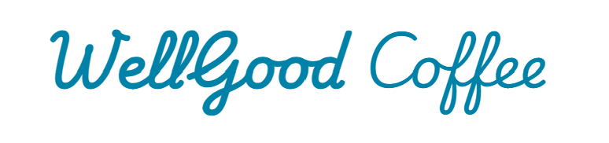
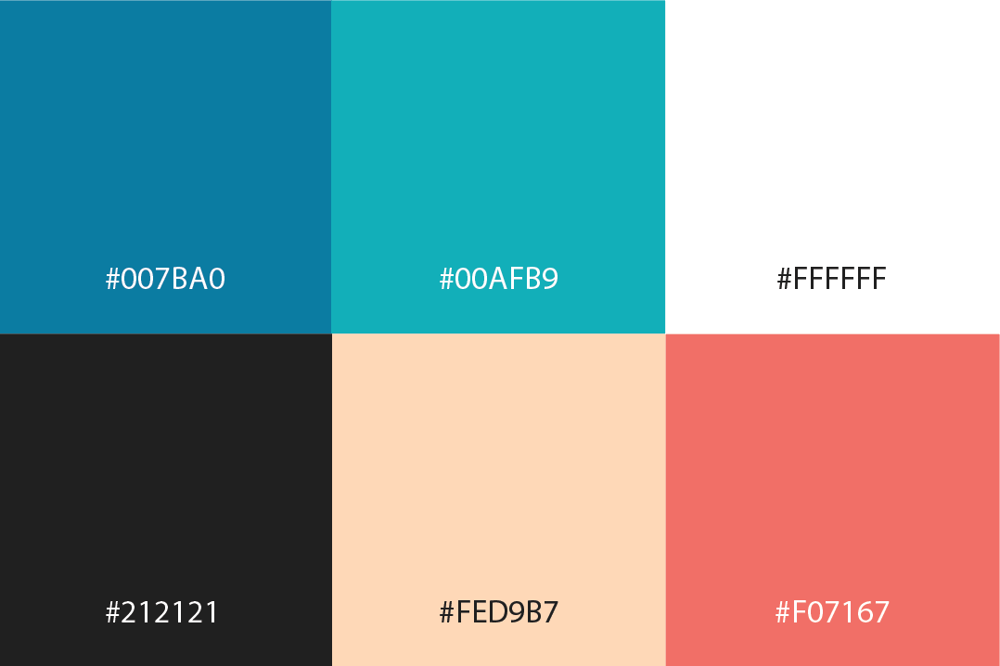
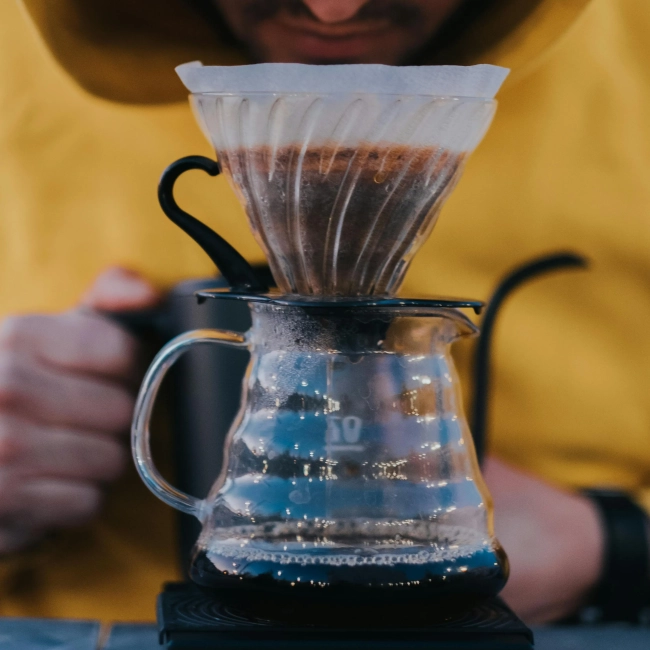
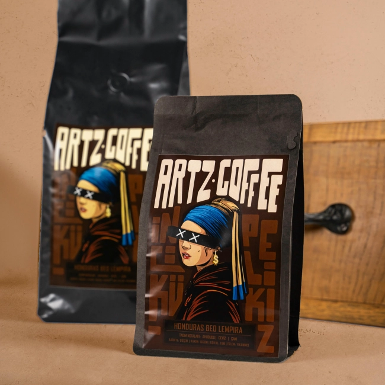
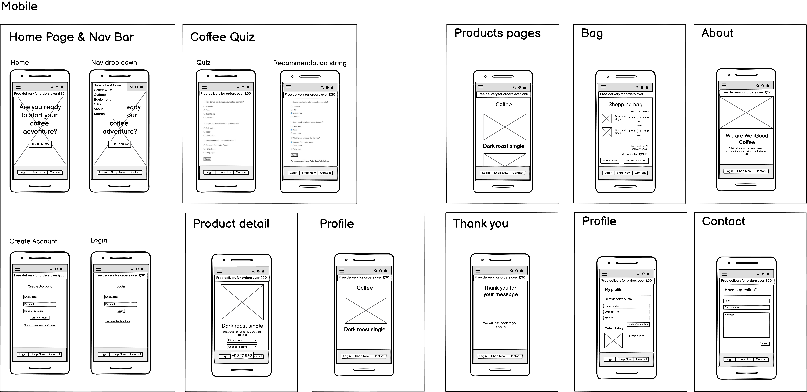
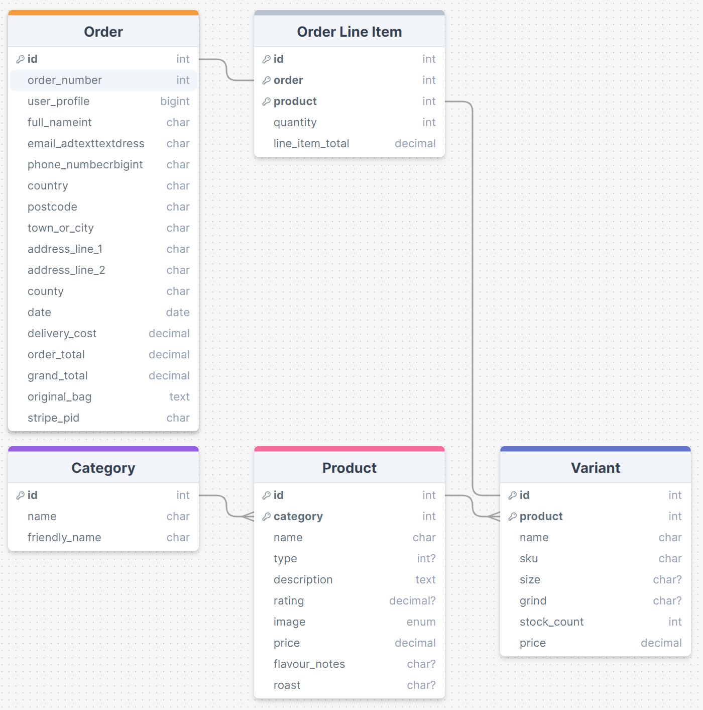
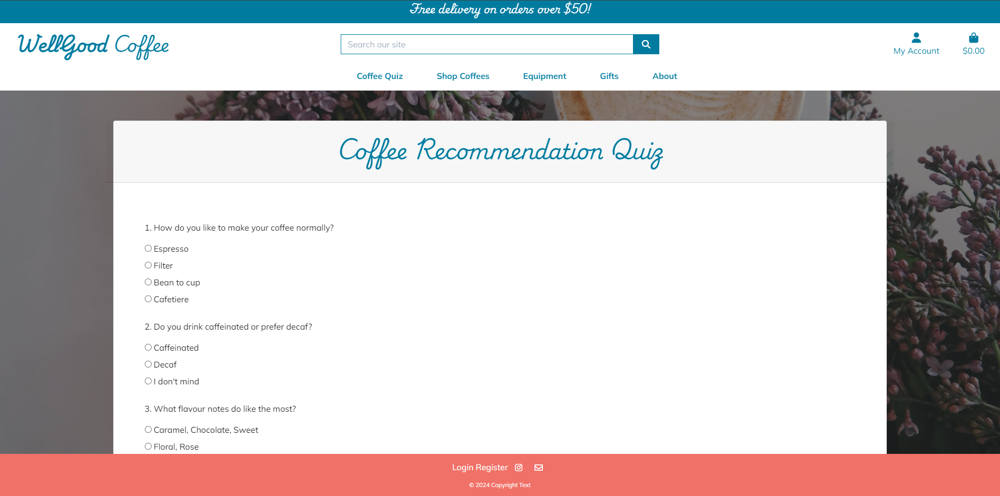
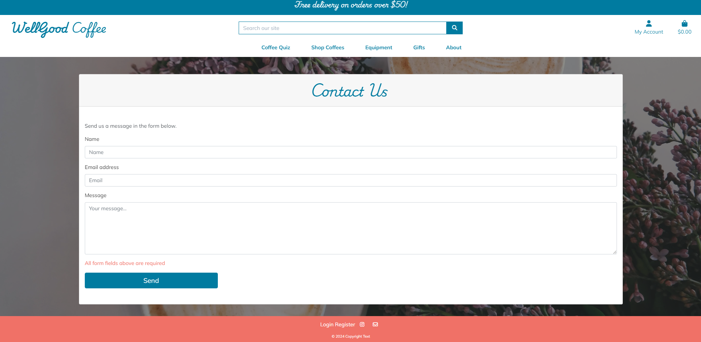
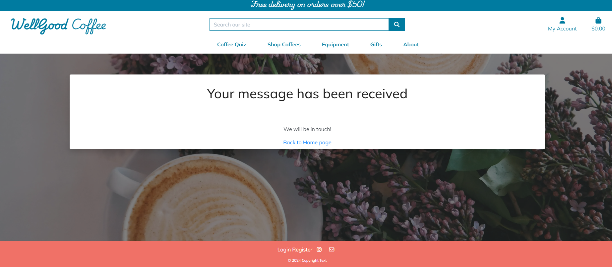

<h1 align="center" id="title"></h1>

WellGood Coffee Roasters is an up-and-coming roastery that have approached me to create a website to showcase their brand and all they have to offer. It is their platform to sell their retail coffee, equipment as well as offer their customers a place to order their coffee just the way they like it.
Their mission is to get a more wide-spread client base, offering delivery to all of the UK.
They specialise in roasting limited edition retail bags of coffee, which works perfectly for their coffee fanatic customers who can choose their favourite coffee notes and get a new bag to try every time they purchase.
They want to inspire their customers to start their real coffee adventure, explore and find a new hobby in doing so, just like they have.

I have created this as my fourth milestone project for the Code Institute's Level 5 Diploma in Web Application Development.

[View the live project here.](https://wellgood-coffee-f56fcdb787d6.herokuapp.com/)

## Table of Contents

1. [User Experience (UX)](#user-experience-(UX))
2. [Features](#features)
3. [Deployment](#deployment)
4. [Technologies Used](#technologies-used)
5. [Credits](#credits)

## User Experience (UX) 

### User stories

<table>
  <thead>
    <tr>
      <th>As a...</th>
      <th>I want to be able to…</th>
      <th>So that I can…</th>
    </tr>
    <tr>
      <th colspan="3">Viewing and Navigation</th>
    </tr>
  </thead>
  <tbody>
    <tr>
      <td>Visitor</td>
      <td>Clearly identify the purpose of the site</td>
      <td>Determine whether the site is what I am searching for</td>
    </tr>
    <tr>
      <td>Shopper</td>
      <td>View a list of products</td>
      <td>Select some to purchase</td>
    </tr>
    <tr>
      <td>Shopper</td>
      <td>Take a coffee quiz</td>
      <td>To work out what sort of coffee would suit me best</td>
    </tr>
    <tr>
      <td>Shopper</td>
      <td>View individual product details</td>
      <td>To view the price, description, product rating, product image to check before potential purchase</td>
    </tr>
    <tr>
      <td>Shopper</td>
      <td>Easily view my basket total spend at any time</td>
      <td>Keep to my budget</td>
    </tr>
    <tr>
      <td>Shopper</td>
      <td>Easily view my postage total</td>
      <td>Keep to my budget and decide whether or not to spend more to meet the free postage threshold</td>
    </tr>
    </tbody>
    <thead>
    <tr>
      <th colspan="3">Registration and User Accounts</th>
    </tr>
    </thead>
    <tbody>
    <tr>
      <td>New visitor</td>
      <td>Register for an account</td>
      <td>To have all orders and profile information in one place for future purchases</td>
    </tr>
    <tr>
      <td>Registered User</td>
      <td>Login or logout</td>
      <td>Access my personal account information and previous purchases</td>
    </tr>
    <tr>
      <td>Registered User</td>
      <td>Reset my password in case I forget it</td>
      <td>Recover access to my account</td>
    </tr>
    <tr>
      <td>Registered User</td>
      <td>Receive an email confirmation after registering</td>
      <td>Verify that my account registration was successful</td>
    </tr>
    <tr>
      <td>Registered User</td>
      <td>Have a personalised user profile</td>
      <td>View my personal order history and order confirmation, and save my payment information</td>
    </tr>
    <tr>
      <td>Registered User</td>
      <td>Have my email address verified by the site</td>
      <td>Ensure my email address and personal data are safe and secure</td>
    </tr>
    <tr>
      <td>Registered User</td>
      <td>See my past order history</td>
      <td>Make repeat orders</td>
    </tr>
    </tbody>
    <thead>
    <tr>
      <th colspan="3">Sorting and Searching</th>
    </tr>
    </thead>
    <tbody>
    <tr>
      <td>Shopper</td>
      <td>Sort the list of available products</td>
      <td>Easily identify the best rated, best priced and categorically sorted products</td>
    </tr>
    <tr>
      <td>Shopper</td>
      <td>Sort a specific category of product</td>
      <td>Find the best priced or best rated product in a specific category, or sort the products in that category by name</td>
    </tr>
    <tr>
      <td>Shopper</td>
      <td>Sort multiple categories of products simultaneously</td>
      <td>Find all associated equipment linked to a word search</td>
    </tr>
    <tr>
      <td>Shopper</td>
      <td>Search for a product by name or description</td>
      <td>Find a specific product I would like to purchase</td>
    </tr>
    <tr>
      <td>Shopper</td>
      <td>Easily see what I've searched for and the number of results</td>
      <td>Quickly decide whether the product I want is available</td>
    </tr>
    <tr>
      <td>Shopper</td>
      <td>Save my billing and shipping details</td>
      <td>Checkout even quicker and more conveniently on future orders</td>
    </tr>
    </tbody>
    <thead>
    <tr>
      <th colspan="3">Purchasing and Checkout</th>
    </tr>
    </thead>
    <tbody>
    <tr>
      <td>Shopper</td>
      <td>Easily select the size, grind type and quantity of a coffee when purchasing it</td>
      <td>Ensure I don't accidentally select the wrong product, quantity, grind type or size</td>
    </tr>
    <tr>
      <td>Shopper</td>
      <td>View items in my bag to be purchased</td>
      <td>Identify the total cost of my purchase and all items I will receive</td>
    </tr>
    <tr>
      <td>Shopper</td>
      <td>View the total cost of my purchase before checking out</td>
      <td>So that I can see what the total cost of my purchase is including any additional costs such as shipping are before making my final purchase</td>
    </tr>
    <tr>
      <td>Shopper</td>
      <td>Adjust the quantity of individual items in my bag</td>
      <td>Easily make changes to my purchase before checkout</td>
    </tr>
        <tr>
      <td>Shopper</td>
      <td>Remove items in my bag</td>
      <td>Easily make changes to my purchase before checkout</td>
    </tr>
    <tr>
      <td>Shopper</td>
      <td>Easily enter my payment information</td>
      <td>Check out quickly with no hassles</td>
    </tr>
    <tr>
      <td>Shopper</td>
      <td>Feel my personal and payment information is safe and secure</td>
      <td>Confidently produce the needed information to make a purchase</td>
    </tr>
    <tr>
      <td>Shopper</td>
      <td>View an order confirmation at checkout</td>
      <td>Verify that I haven't made any mistakes</td>
    </tr>
    <tr>
      <td>Shopper</td>
      <td>Receive an email confirmation after checking out</td>
      <td>Keep the confirmation of what I've purchase for my records</td>
    </tr>
    <tr>
      <td>Shopper</td>
      <td>Contact the store easily with any questions or concerns</td>
      <td>Get further information about a product or purchase</td>
    </tr>
    <tr>
      <td>Shopper</td>
      <td>See at a glance if there are any items in my shopping basket</td>
      <td>See quickly at a glance if there are any items already in my basket</td>
    </tr>
    <tr>
      <td>Shopper</td>
      <td>See how much I need to spend to qualify for free shipping</td>
      <td>Ensure I am getting the best value on potentially larger purchases</td>
    </tr>
    <tr>
      <td>Shopper</td>
      <td>Be able to checkout without registering for an account</td>
      <td>Checkout quickly and easily even if I don't want to register for an account with the store</td>
    </tr>
    </tbody>
    <thead>
    <tr>
      <th colspan="3">Admin and Store Management</th>
    </tr>
    </thead>
    <tbody>
    <tr>
      <td>Store Owner/Staff Member</td>
      <td>Add a product</td>
      <td>Add new items to my store</td>
    </tr>
    <tr>
      <td>Store Owner/Staff Member</td>
      <td>Edit/Update a product</td>
      <td>Change product prices, descriptions, images and other product criteria</td>
    </tr>
    <tr>
      <td>Store Owner/Staff Member</td>
      <td>Delete a product</td>
      <td>Remove items that are no longer for sale</td>
    </tr>
  </tbody>
</table>

### User Journey
I created UX flow charts using FigJam to map out the user stories.

New visitor

Returning and frequent visitor

### Design

#### Colour Scheme
I used Coolor to choose a hipster-vibe colour palette for the site. Once chosen, I then checked colour combinations of the palette through the contrast checker to make sure the readability of my site was at a high standard and that I was followed good practices for accessibility.

#### Colour Accessibility
			
I checked the contrast on any colour combinations I intended to use from my palette with [Coolor contrast checker](https://coolors.co/contrast-checker) to determine if they met the [WCAG AA guidelines](https://www.w3.org/TR/WCAG21/).

The dark blue and black and good readability. I tested the red to see if that would be acceptable for text use, but the contrast was not high enough so this along with the other colour in the colour palette will just be used for accents where needed.

#### Typography
I chose a cursive font for titles, 'Playwrite IE' and 'Mulish' a simple sans-serif for the body text that is easy to read. I wanted to ensure I maintained good readability, which in turn will give an overall better user experience.

#### Imagery

  - ##### Logo
    I created the logo myself using the main title font 'Playwrite IE' and designing the logo in Adobe Illustrator.
    

  - ##### Background images
    I used two images for backgrounds on the home page and about page, which I sourced from [Pexels.com](pexels.com)

  - #### Product Images
    Equipment product images were also sourced from Pexels, all of the attributions for these images are in the below table. For the coffee bags I used a coffee bag mockup image from Freepik as well and edited to included my artwork in Photoshop.

  <table>
  <thead>
    <tr>
      <th>Product</th>
      <th>Image</th>
      <th>Attribution</th>
    </tr>
  </thead>
  <tbody>
    <tr>
      <td>Homepage background</td>
      <td></td>
      <td><a href="https://www.pexels.com/photo/two-cup-of-coffee-lattes-on-saucers-377903/">Image by Brigitte Tohm</a> on Pexels</td>
    </tr>
    <tr>
      <td>About page background</td>
      <td></td>
      <td><a href="https://www.pexels.com/photo/man-operating-a-machine-at-a-coffee-roasting-factory-4816478/">Image by Maksim Goncharenok</a> on Pexels</td>
    </tr>
    <tr>
      <td>Coffee icon on coffee bags</td>
      <td></td>
      <td><a href="https://logowik.com/coffee-vector-icon-16731.html">Icon by Logowik</a> on Logowik</td>
    </tr>
    <tr>
      <td>Coffee Bag Mockup</td>
      <td></td>
      <td><a href="https://www.freepik.com/free-photo/white-plastic-tea-bag_3542875.htm#fromView=search&page=1&position=28&uuid=a4bb1b3b-8313-43fb-a456-eea4308b30a3">Image by Freepik</a> on Freepik</td>
    </tr>
    <tr>
      <td>Aeropress filter paper</td>
      <td></td>
      <td><a href="https://www.pexels.com/photo/crop-faceless-barista-pouring-hot-water-into-aeropress-coffee-maker-7421229/">Image by Marta Dzedyshko</a> on Pexels</td>
    </tr>
    <tr>
      <td>V60 Starter Kit</td>
      <td></td>
      <td><a href="https://www.pexels.com/photo/brewing-coffee-in-a-dripper-15672166/">Image by Onur Kaya</a> on Pexels</td>
    </tr>
    <tr>
      <td>Blend Coffee Bean Gift Set</td>
      <td></td>
      <td><a href="https://www.pexels.com/photo/pack-of-coffee-in-different-size-13741286/">Image by Dorukhan Pekcan</a> on Pexels</td>
    </tr>
    <tr>
      <td>Single Origin Coffee Bean Gift Set</td>
      <td></td>
      <td><a href="https://www.pexels.com/photo/coffee-in-bags-with-creative-design-13741281/">Image by Dorukhan Pekcan</a> on Pexels</td>
    </tr>
    <tr>
      <td>Aeropress Starter Kit</td>
      <td></td>
      <td><a href="https://www.pexels.com/photo/person-about-to-put-aeropress-top-into-carafe-2074123/">Image by Viktoria Alipatova</a> on Pexels</td>
    </tr>
    <tr>
      <td>Grinder, Mug and Coffee Set</td>
      <td></td>
      <td><a href="https://www.pexels.com/photo/cup-with-mustache-and-beard-pattern-on-box-7488474/">Image by Karen Laårk Boshoff</a> on Pexels</td>
    </tr>
    <tr>
      <td>Manual Coffee Grinder</td>
      <td></td>
      <td><a href="https://www.pexels.com/photo/brown-coffee-grinder-beside-mug-362135/">Image by Mateusz Dach</a> on Pexels</td>
    </tr>
    <tr>
      <td>Metal Filter</td>
      <td></td>
      <td><a href="https://www.amazon.co.uk/AeroPress-Stainless-Steel-Reusable-Filter/dp/B0B3BTYSTD">Image from</a> Amazon</td>
    </tr>
    <tr>
      <td>V60 Filter Papers</td>
      <td></td>
      <td><a href="https://www.themaltmiller.co.uk/product/hario-v60-coffee-filter-papers-size-02-white-40-pack/?v=79cba1185463">Image from</a> The Malt Miller</td>
    </tr>
    <tr>
      <td>Caramel Syrup</td>
      <td></td>
      <td><a href="https://wavescoffeeco.co.uk/product/caramel-coffee-syrup/">Image from</a> Waves Coffee Co</td>
    </tr>
    <tr>
      <td>Chocolate Syrup</td>
      <td></td>
      <td><a href="https://wavescoffeeco.co.uk/product/chocolate-coffee-syrup/">Image from</a> Waves Coffee Co</td>
    </tr>
    <tr>
      <td>Vanilla Syrup</td>
      <td></td>
      <td><a href="https://www.amazon.co.uk/Simply-Vanilla-Syrup-1l/dp/B004FN0PA8">Image from</a> Amazon</td>
    </tr>
  </tbody>
</table>
 

I used icons from Font Awesome throughout the site [Font Awesome](https://fontawesome.com/).

### Wireframes

I used Figma and Balsamiq to plan and design my wireframes and user journey. I like using Figma in particular because it always you to brainstorm and keep all ideas and inspiration in one place as a singular visual to refer back to, which has been very useful throughout the project. I designed my web app in mobile format initially, before moving onto bigger screens, to ensure responsiveness was considered from the beginning, especially since most users will predominantly use their phones to access this app.

I had planned in an extra section for the site into the wireframes, which unfortunately I have not had enough scope to manage, which is a Suscribe & Save section, which would be a nice-to-have for future improvements to the site.

  - #### Mobile Wireframes

  

  - #### Tablet Wireframes

  

  - #### Laptop Wireframes

  

[Link to my Figma page](https://www.figma.com/design/IYOwfhepgdhys2z3s7EsUc/Milestone-4---WellGood-Coffee-Roasters?node-id=0-1&t=pPxFqoFWM4APLAXC-1)
  
### Database Schema
The database schema flow charts were created using [DrawSQL](https://drawsql.app/).

#### Orders and Products

#### Profiles

[Back to top](#title)  

## Features

### General

* My site is fully responsive and can be viewed and used effectively on all screen sizes down to 320px width by 480px height.
* I have considered readability contrast carefully for all visual elements.
* __Favicon__ - I have included a Favicon page tab icon to make the page look professional and consistent.

* __Reponsive Nav Bar__ - The navigation bar at the top of all the pages reduces to an accordion menu on tablet and mobile view for ease for use for the user. The options displayed on the nav bar are also dependent on whether a user is logged in or not, for an optimum user experience where options, such as 'Register' are no longer visible for logged in users. This keeps the pages clean and easier to navigate. I have included a search icon instead of a search bar on mobile and tablet versions, so the bar does not take up unnecessary space on the screen when not required.

* __Footer__ - Just like the nav bar, the links displayed in the footer are also dependent on whether a user is logged in or not, for an optimum user experience where options, such as 'Register' are no longer visible for logged in users. This keeps the pages clean and easier to navigate.

* __Logo__ - I created my simple text logo using the Playwrite IE font to keep a design consistency within the site.

* __Toast messages__ - At various actions, messages will flash at the top right of the page just below the nav bar to confirm to the user for instance, that a user account has been created, or a product has been added to the shopping bag. This gives the user a clear explanation of what has happened to avoid any unnecessary confusion.

## Landing page

### Register page

* __Registration form__ - This form submits a new username and password to the database and starts a session cookie, which triggers the 'Profile' page to be active. If a super user logs in, it activates the 'Product Management' page where the user can add products, and also makes 'edit' and 'delete' options visible on the product page annd product detail pages.

* __Password pattern required__ -  To make sure the user is creating strong passwords to keep their account secure, I have included an HTML5 regex pattern, so that the registration form will not submit unless the user has conformed to the requirements.

* __Requirement prompts__ -  So it is clear what patterns are required for passwords and usernames, I have included prompts should the user fill a field in incorrectly.

### Login page

* __Login form__ - This form starts a session cookie, which triggers the 'Profile' to become visible and the 'Product Management' page if a super user has logged in.

* __Requirement prompts__ -  So it is clear what patterns are required for passwords and usernames, I have included prompts should the user fill a field in incorrectly.

### Search bar in navigation bar

* __Search product names and descriptions__ - The search bar allows users to add search words that will be cross referenced across the whole database and bring up products that match the search in their name or description.

### Profile page

* __Default delivery information__ - This page allows the user to add their chosen default delivery information for future purchases.

* __Order history__ - The user can view their previous orders all in one place.

### Product Management page

* __Add product__ - Allows super users to add products to the site with this form without them having to access the django admin board.

### Products page

* __Coffee type tag__ - The Coffee type (Single Origin/Blend) will appear with the respective product if it is in the database. For coffee fanatics this is a key factor to consider when choosing coffee so felt it was important to highlight easily for the user.

* __Flavour notes tag__ - Similarly flavour notes are important when shoppers are considering what coffee to purchase so again, made sure this was visible on the product list pages for the users' ease. When products have a blank flavour note or type field in their variant, it is not set to visible on the product listing.

* __Review rating__ - Review ratings are visible for each product on the page.

* __Sort bar__ - The sort bar allows users to sort all the products on the page via name, price and rating, to again make it easier for them to tailor their shopping experience based on their requirements.

* __Edit and delete product buttons__ - The edit and delete buttons appear next to each product when a superuser is logged in so they can find and choose the product they wish to edit more easily than within the django admin panel.

### Product Detail page

* __Edit and delete product buttons__ - The edit and delete buttons appear next to each product when a superuser is logged in so they can find and choose the product they wish to edit more easily than within the django admin panel.
* __Dropdown options for size and grind type__ - for coffee products to keep the variants all in one place rather than listing them all individually in the product list pages.
* __Quantity__ - decrease and increase quantity before adding to bag.

### Coffee Quiz

* __Product recommendation result__ - I have seen on Coffee websites often include a coffee quiz as part of their user journey to help shoppers navigate through the range with a simple 3 step quiz. The user chooses their favourite flavour notes along with brewing choice etc. and I have put some basic logic together to give them a product recommendation. In future I would love to develop and polish this concept more, as I feel it really adds a positive experience to the user journey.

### Bag page

* Users can increase and decrease quantities of items in their bag.
* Users can remove items from their bag.
* They can view total price.
* They can see how much more they need to spend to qualify for free shipping.

### Checkout page

* Fields will be pre-populated with any details the user has already saved to reduce checkout time
* There is an order summary view so shoppers can review their purchase before submitting their payment
* Once submitted, the user will receive an order confirmation email and an order summary page redirect. 

### Contact Form

* I have included a functional contact form for users to contact me.
* When a form is submitted, I receive an email with the user's message, name and email address included so I can respond to their query.
* All inputs are required.
* The contact form checks the input is valid before sending and if not it will alert the user - the email input will not work unless a proper email address is added, and you cannot leave any field blank.

## Contact form success page

* A quick message to the user to confirm their message has been submitted and a link to the home page included.

## Error 404 page

* Should any errors occur, the user will be directed to this page. I have included this page in the sendmail js file function, should the form not successfully submit. The page has a button that links back to the app page, so the user can return back to the main site easily and quickly.

## Possible Future Features

* __Subscribe & Save__ - The option for users to sign up for coffee subscriptions would be valuable as I can see from my market research that subscriptions for items such as coffee are very popular.
* __Sold Out image overlay__ - To provide the user with the ability to add items to their own digital shopping list.
* __More polished Coffee Quiz__ - A more polished coffee quiz would be great in the future for this site. A big improvement would be having the links to one or two products on the actual pages to add straight to the bag, rather than just a text recommendation as it currently stands.
* __Quick add to bag button__ - To make shopping even easier, having an add to bag button for each product on the product list pages would be a good build, like on Amazon, as it would encourage more impulse buying.
* __Reviews__ - To give the users the opportunity to rate products and leave reviews for products they have purchased would help develop a greater sense of community on the site as well as help shoppers make a more educated decision on their purchases. It also bolsters the fact that the site is trustworthy and reliable when good reviews can be seen. 

## Accessibility

I did the following to ensure good accessibility:
* Designed my app intuitively so it was easy to navigate around and create a positive user journey.
* Added aria labels to the links across the site to achieve a higher accessibility score.
* Used semantic HTML when building pages.
* Checked colour contrast against accessbility standards (mentions above in Colour Accessibility section)
* Added alt tags to all images.

## Media Queries

* I used Media Queries to debug and override some display issues that were not rectified with Materialize's responsive layouts.

# Deployment #

I used Heroku to deploy my site, coupled with ElephantSQL to host my relational database for free and Amazon AWS to host my media and static files.

## ElephantSQL

1. From the [ElephantSQL](https://www.elephantsql.com/) homepage, you need to sign up for an account or log in.

2. Once logged in, you will be directed to the Instances page for your log in. You need to click on 'Create a new instance' in the top right hand corner.

3. Name your database, choose the 'Tiny Turtle' free plan, select the closest region to your location and then click the 'Create Instance' button and the bottom right corner of the page.

4. Then you will be able to see your new instance listed on your instances page. Click on your database name.

5. Within the database details, you will see a URL section -  copy the URL link and save for later during the Heroku deployment.

## Heroku

1. You will need to install some dependencies to that you can use Postgres on your deployed site.

    "pip3 install dj_database_url
    pip3 install psycopg2"
  
2. Before navigating to the Heroku site to deploy, you need to make sure you have an up-to-date requirements.txt file and Procfile created in your repository. These will make sure Heroku knows all the required applications and their correct versions to deploy and function properly.

3. To create the requirements.txt file, use the following command in your terminal:

    "pip3 freeze --local > requirements.txt"

4. Similarly for the Procfile, use the following command in your terminal:

    "web: gunicorn [your app name].wsgi:application"

5. Check both files have been created properly. A couple of potential issues to be made a aware of:
* Make sure Procfile has the Heroku logo next to it in the file explorer view in your IDE
* Check that there are no blank lines at the end of the Procfile and delete them if found, as this can prevent it from deploying when being read by Heroku. Save, commit and push these files to your repository.

6. Login or register on the [Heroku](https://www.heroku.com) homepage.

7. Once on your dashboard, click the 'New' button and then 'Create new app' when it drops down.

8. Type in a unique app name, choose your region and click 'Create App'.

9. Now this has been created, we can now linke this to our repository in GitHub and our ElephantSQL database. Click on 'settings' heading in the app dashboard, then scroll down to click 'Reveal Config Vars'.

10. Add your config variables in this section for Heroku to build the app - these will be all the variables in your env.py file. It will look like this:

    "
    | KEY | VALUE |
    | -- | -- |
    | AWS_ACCESS_KEY_ID | `your variable here if you have it already` |
    | AWS_SECRET_ACCESS_KEY | `your variable here if you have it already` |
    | DISABLE_COLLECTSTATIC | 1* |
    | DATABASE_URL | `your variable here`** |
    | EMAIL_HOST_PASS | `your variable here` |
    | EMAIL_HOST_USER | `your variable here` |
    | SECRET_KEY | `your variable here` |
    | STRIPE_PUBLIC_KEY | `your variable here` |
    | STRIPE_SECRET_KEY | `your variable here` |
    | STRIPE_WH_SECRET | `your variable here` |
    | USE_AWS | True |
    | DEVELOPMENT | True*** |
    "

    *This is temporary and will be removed later.

    **'POSTGRES_DB_URL_FROM_ELEPHANT_SQL' - paste your ElephantSQL URL link in here.

    ***DEBUG set to TRUE is only for during the development phase, so make sure when deploying the finished app, to delete this variable.

11. You then need to add the hostname of your Heroku app to settings.py like below:

    "
    ALLOWED_HOSTS = ['wellgood-coffee-f56fcdb787d6.herokuapp.com', 'localhost']
    "

11. Now the config variables are set up, go to the 'Deploy' heading. The quickest, easiest way to deploy is through selecting the 'Connect to GitHub' deployment method. Go through the login GitHub authentication steps.

12. Once your GitHub account is connected, select the respository you want to run in the 'Connect to GitHub' section.

13. For easier updating if you make changes to your repository, enable automatic deployment from GitHub.

14. Now you are ready to click the 'Deploy' button from the main branch. Heroku will now build your app.

15. Finally, we need to click on the 'More' button at the top of the dashboard screen and select 'Run Console' from the dropdown. This will set up the models in the ElephantSQL database. This is where we will set up the tables in the database we have created on ElephantSQL.

16. We now need to migrate our database to our ElephantSQL database. Go to the top right hand of Heroku and select, more then select Run console. Type bash and click Run then type the following commands.

    "
    python3 manage.py makemigrations
    python3 manage.py migrate
    "
    
17. You can then create a superuser by running the below command and filling in your details.

      "
      python3 manage.py createsuperuser    
      "

18. Now that the relational database has been set up and the tables created and superuser created, we can now click open app and the application should now open in a new tab. If you haven't set up your AWS yet your CSS and images wont have loaded yet. We will set that up next.

19. You can now deploy from Heroku by going to the 'Deploy' heading in the Heroku Dashboard, selecting 'Connect to Github' deployment method and selected your Github repository in the list. Then enable automatic deployment for ease of updates, select 'Main' branch and click the button 'Deploy Branch'. Once the build has successfully you can click the 'Open App' button in the top right corner, but be aware that because we have not linked the static and media folders yet, it will not display properly yet.

## Amazon AWS

  ### Setting up an S3 Bucket
  1. Create an [Amazon AWS](aws.amazon.com) account

  2. Search for **S3** and create a new bucket
      * Allow public access
      * Acknowledge

  3. Under **Properties > Static** website hosting
      * Enable
      * `index.html` as index document
      * Save

  4. Under **Permissions > CORS** use:
          "
          [
        {
            "AllowedHeaders": [
                "Authorization"
            ],
            "AllowedMethods": [
                "GET"
            ],
            "AllowedOrigins": [
                "*"
            ],
            "ExposeHeaders": []
        }
      ]
      "

  5. Under **Permissions > Bucket Policy**:
      * Generate Bucket Policy and take note of **Bucket ARN**
      * Chose **S3 Bucket Policy** as Type of Policy
      * For **Principal**, enter `*`
      * Enter **ARN** noted above
      * **Add Statement**
      * **Generate Policy**
      * Copy **Policy JSON Document**
      * Paste policy into **Edit Bucket policy** on the previous tab
      * Save changes

  6. Under **Access Control List (ACL)**:
      * For **Everyone (public access)**, tick **List**
      * Accept that everyone in the world may access the Bucket
      * Save changes

  #### Setting up AWS IAM
  1. From the **IAM dashboard** within AWS, select **User Groups**:
      * Create new group e.g. `manage-wellgood-coffee`
      * Click through without adding a policy
      * **Create Group**

  2. Select **Policies**:
      * Create policy
      * Under **JSON** tab, click **Import managed policy**
      * Choose **AmazongS3FullAccess**
      * Edit the resource to include the **Bucket ARN** noted earlier when creating the Bucket Policy:

      "
            "Resource": [
                            "arn:aws:s3:::wellgood-coffee",
                            "arn:aws:s3:::wellgood-coffee/*"
                  ]
      "

      * Click **next step** and go to **Review policy**
      * Give the policy a name e.g. `wellgood-coffee-policy` and description
      * **Create policy**

  3. Go back to **User Groups** and choose the group created earlier
      * Under **Permissions > Add permissions**, choose **Attach Policies** and select the one just created
      * **Add permissions**

  4. Under **Users**:
      * Choose a user name e.g. `wellgood-coffee-staticfiles-user`
      * Select **Programmatic access** as the **Access type**
      * Click Next
      * Add the user to the Group just created
      * Click Next and **Create User**

  5. **Download the `.csv` containing the access key and secret access key. This will NOT be available to download again so be sure to not miss this step**

  #### Connecting Django to S3

  1. Install boto3 and django-storages
      "
      pip3 install boto3
      pip3 install django-storages
      pip3 freeze > requirements.txt
      "

  2. Add the values from the `.csv` you downloaded to your Heroku Config Vars:
      "
      AWS_ACCESS_KEY_ID
      AWS_SECRET_ACCESS_KEY
      "

  3. You can now delete the `DISABLE_COLLECTSTATIC` variable from your Config Vars and deploy your Heroku app again - if you have enabled automatic deployment in Heroku this will happen automatically the next push you make to GitHub

  4. Create a new folder called `media` (at the same level as the newly added `static` folder) in your S3 bucket and upload any required media files to it such as product images etc., and make sure to make them publicly accessible under "Permissions"

## Forking the GitHub Repository

Forking allows users to make a copy of an original repository in GitHub and view and make changes to it without changing the original repository. To create a fork:
1. Once logged into GitHub, follow the link to your chosen GitHub repository, or use the search bar to find it on the GitHub home page.
2. Once in the repository window, click the 'Fork' drop down arrow button in the top right-hand corner.
3. Select 'Create new fork'.
4. Check the details in the window before clicking the green 'Create Fork' button.
5. You will now be able to find the copy of the repository in your own GitHub account.

## Making a Local Clone

1. Once logged into GitHub, follow the link to your chosen GitHub repository, or use the search bar to find it on the GitHub home page.
2. Once in the repository window, click the green 'Code' button.
3. To clone the repository using HTTPS, copy the link provided below the HTTPS header.
4. Open a terminal in your code editor.
5. Change the location in the current working directory to where you want the cloned directory to be created.
6. Type "git clone" into the terminal, and then paste the URL you copied and click enter.
7. This should have created a local clone of the repository.
8. Here is the live link to my website - https://wellgood-coffee-f56fcdb787d6.herokuapp.com/

[Back to top](#title)  

# Testing #

### Stripe Test Card Payments
To put through test payments when using the site, you can use Stripe test card details which appear as:

4242 4242 4242 4242   04/42  424 24242

I have documented my testing in a separate document [TESTING.md](TESTING.md)

[Back to top](#title)  

# Technologies Used #

## Languages used
* HTML
* CSS
* Python
* Javascript

## Databases used
* PostgresSQL relational database
* Sqlite3 in development - A relational database
* PostgreSQL via ElephantSQL in production - A relational database

## Frameworks, Libraries & Programs Used
* [Techsini](https://techsini.com/multi-mockup/) - To generate a screen mockup of my web app for this README.
* [Gitpod](https://gitpod.com) - To create, edit, preview and push my code to my GitHub repository.
* [Git](https://git-scm.com/) - For version control.
* [GitHub](Github.com) - To store versions of my site's repository while developing and then for deployment.
* [Heroku](heroku.com) - I deployed my project through Heroku.
* [Adobe Illustrator](https://www.adobe.com/uk/products/illustrator.html) - For designing the logo and favicon.
* [Balsamiq](https://balsamiq.com/) - For wireframes.
* [DrawSQL](https://drawsql.app/) - To create my database schema.
* [Figma ad FigJam](figma.com) - Used as a design board to lay out my wireframes and keep a copy of my design thought process all in one place. I also used it to creat UX flow charts while planning my web app.
* [Adobe Photoshop](https://www.adobe.com/uk/products/photoshop.html) - Used for exporting any site images as .webp files to reduce file size and in turn improve the performance of my site. I also used it to create the coffee bag mock-up images for all the coffee products.
* [ElephantSQL](https://www.elephantsql.com/index.html) - Hosted my PostgresSQL database online.
* [Coolors](https://coolors.co/contrast-checker/112a46-acc8e5) - Contrast checker to test readability.
* [Django](https://www.djangoproject.com/) - An open source python web framework.
* [Font Awesome](https://fontawesome.com/) - For all the icons in my web app.
* Google Dev Tools - Used to troubleshoot issues both front-end and back-end. It also includes Lighthouse which I used for testing.
* [Google Fonts](https://fonts.google.com/) - To import the fonts I chose for the website.
* [JSHint](https://jshint.com/) - To validate javaScript code.
* [W3C](https://validator.w3.org/) - To validate and test HTML and CSS code.
* [Favicon](https://favicon.io/) - Generated my favicon files from the favicon I designed.
* [Amazon AWS](https://aws.amazon.com/) - For static file storage.
* [Bootstrap](https://getbootstrap.com/) - For the layout and framework of the website.
* [Code Institute PEP8 Python Linter](https://pep8ci.herokuapp.com/) - To check for linting errors in my python code.
* [Stripe](https://stripe.com/gb) - For payment processing

[Back to top](#title)  

# Credits

* Favicon : I used a [Favicon generator](https://favicon.io/) to create the appropriate files for me to upload to my site, as well as this code snippet to install it site-wide.
* Code Institute Boutique Ado walkthrough helped me work out how to best approach creating this project, so I have used the tutorials to guide the planning process and basic structure and then heavily modified and build upon the basic code to suit the my site's requirements.
* Google fonts for ['Playwrite IE' typography.](https://fonts.google.com/specimen/Playwrite+IE) and ['Mulish' typography.](https://fonts.google.com/specimen/Mulish)
* Logo and favicon I designed myself.
* Product images I have credited here : [Imagery](#product-images) Most are from [Pexels](pexels.com).
* [Intl documentation](https://developer.mozilla.org/en-US/docs/Web/JavaScript/Reference/Global_Objects/Intl/NumberFormat) - this site helped me understand Intl number formatting to form a solution for my price display bug in my testing file.
* [SQLite DB Dumpdata Backup](https://hevodata.com/learn/sqlite-to-postgresql/#Step1) : This showed me how to export my SQLite files into JSON files for me to turn into fixtures for adding to online database.
* I have used Bootstrap frameworks to build and layout my site.

### Content

* All product descriptions were made up using ChatGPT.
* All other static content was written my myself.

### Thanks

* Martina Terlevic my CI mentor, for her encouragement and advice.
* Liz Curtis my friend and fellow coder, for patiently listening, giving encouragement and brainstorming with me when I was troubleshooting.
* The big and little human beings of the Ulloa-James household who have been very patient with me, allowing me the time day or night to get my coding done.

[Back to top](#title)