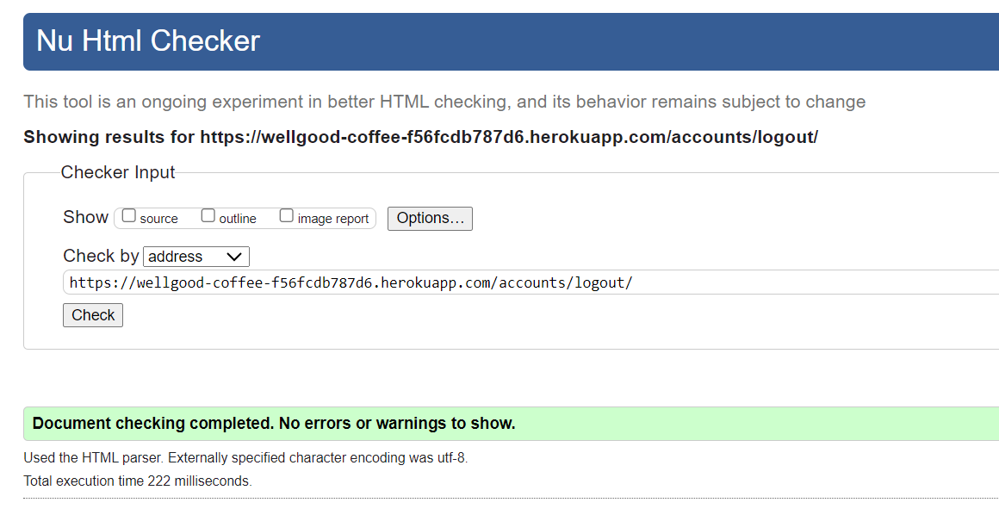
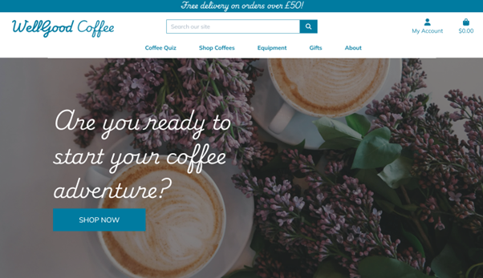
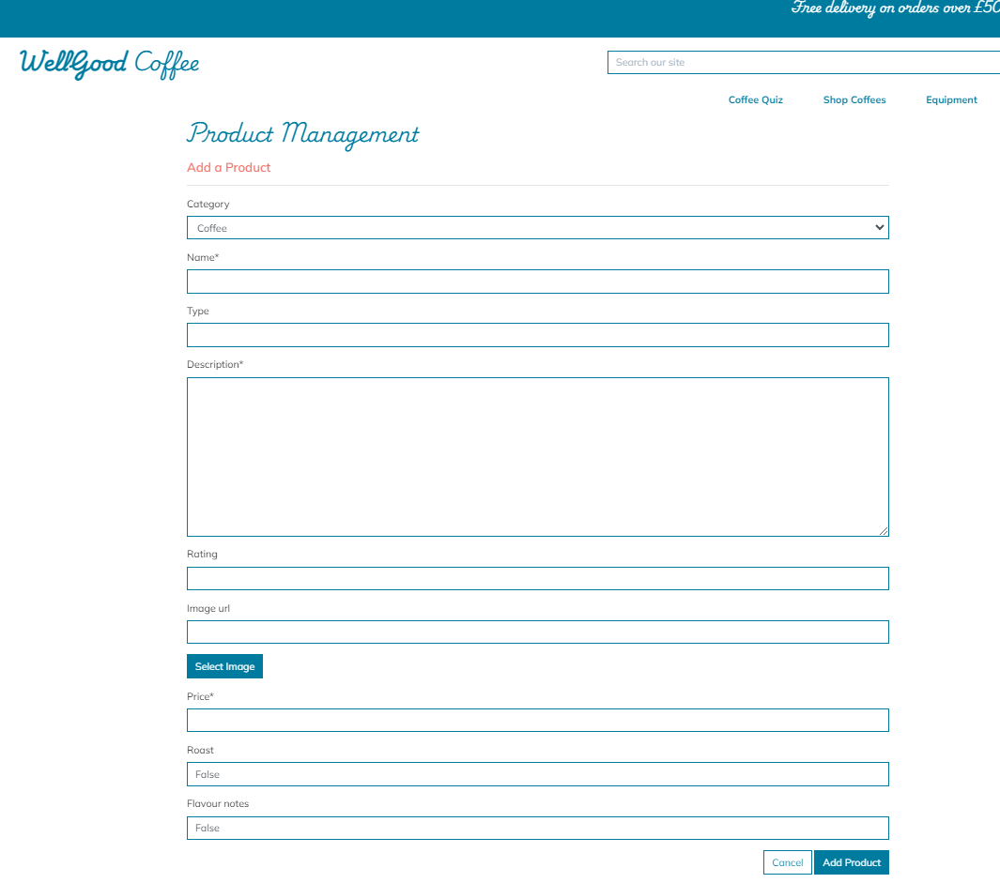

# WellGood Coffee Testing

[View the live project here.](https://wellgood-coffee-f56fcdb787d6.herokuapp.com/)

As with any project, I have been rigorously testing throughout the development process of this web application. I have documented my testing strategy that I planned before I started developing, as well as main bugs that arose whilst developing and how I approached fixing them. I have also tested my web app on different devices and asked family and friends to use and give feedback as to how to improve user experience and inform me of any bugs spotted during use.

With the scale of this project in the grand scheme of things being quite small, automated testing with softwares like Jest or Pytest, for Javascript and Python respectively in this instance it has not been necessary, but I undestand with larger projects with more extensive functions, that this would be useful and essential. I am keen to use Jest and Pytest in future larger projects.

I have applied what I have learned about Test Driven Development into my project and documented some examples of where I have used it in this file.

I have used a mixture of manual and automated testing while developing, both of which play a key role in forming a web application that works correctly and consistently. Automated testing can be great for doing quick overview results, for example checking code compliant with style guides etc., especially with more extensive projects and applications. Manual testing has allowed me to look at things at a deeper level, checking things like user experience design and in turn finding areas for improvement to strengthen my application as a whole. Using both has allowed me to build reliable functions and code and a higher quality end product.

# Table of Contents

1. [Automated Testing](#automated-testing)
2. [Test Driven Development](#test-driven-development)
3. [Manual Testing](#manual-testing)

# AUTOMATED TESTING

## HTML Validator - [W3C](https://validator.w3.org/)

I put every template page in my site into the HTML validator. This was useful to highlight some code errors that I had missed looking through manually. I have rectified all valid errors and updated my code during this process.

### Home Page

#### Before

#### After updates

### Coffee Quiz

#### Before

#### After updates

### Product List Page

### Product Detail Page

### About Page

#### Before

#### After updates

### Contact Page

#### Before

#### After updates

### Profile Page

The validator would not work for the deployed link of this page, saying it was not retreiveable. This will be due to the fact that the profile only loads when a session cookie is in place from a user login, so it would not be able to render in the validator. To work around this I added the raw code into the validator, and checked through for any justified errors. The validator, due to the fact the raw code has templating code in it that refers to the base.html for the header etc., as well as having python language in it, it was throwing alot of irrelevant errors, as you can see below. I checked each of them one by one, and none were justified errors that required changes.

### Product Management Page / Add Product Page

The validator highlighted:
* __Warning:__ 

I updated what I could, but the 'aria-describedby' error is automated code wihtin the template and crispy forms that I cannot update. You will see some more of these below.

### Edit Product Page

### Sign In Page

### Sign Out Page

### Register Page

* Again, this page includes automated code from the crispy forms and templating that I cannot edit to rectify the errors displayed.

### Checkout Page

### Bag Page

## CSS Validator - [W3C](https://jigsaw.w3.org/css-validator/)

No errors were found in my CSS code when put through the validator.

## JSHint Validator - [JSHint](https://jshint.com/)

All javascript files are working as they should.
The undefined variables highlighted below are either jquery, or defined in inline script snippets on their respective templates.

### Product.js
* __Warning:__ 

### Countryfield.js
* __Warning:__ 

### Quiz.js
* __Warning:__ 

## Python Validator - [Code Institute Python Linter](https://pep8ci.herokuapp.com/)

After one final code tidy up, I validated all python code that isn't automatically generated, with the Code Institute Python Linter and returned no errors bar the views.py file below for the Home app, which I have amended accordingly.

### views.py file

## Lighthouse

To test performance and accessibility, I used Lighthouse within the Chrome Developer Tools. I improved my Accessibility in particular by making sure I had included meta tags and data and that all relevant objects had alt tags and aria labels.

| Page | Results |
| --- | --- |
| Home Page |  |
| About Page |  |
| Login Page |  |
| Register Page |  |
| Quiz Page |  |
| Profile Page |  |
| Contact Page |  |
| Product Management Page |   The accessibility score was lower on this page due to it wanting to see aria labels on certain form inputs. Unfortunately, these particular inputs were crispy form inputs generated so I was not able to rectify this in this particular instance.|
| Edit Product Page |  |
| Product List Page |  Before - To improve my scores I removed an unneccessary aria-label and did a sitewide compression of all images  After|
| Product Detail Page |  Before - To improve my scores I removed an unneccessary aria-label and did a sitewide compression of all images  After|
| Checkout Page |  |
| Bag Page |  |
| Performance issues |  Most pages had a performance score of 85-90 due to the issues above, which has been down to the fact that the site is calling to alot of external sources to load, coupled with the framework meaning that again code is being sourced from numerous files to formulate a singular page. Given more time I would look into this issue further as a future improvement. Compressing the images on the site did improve load time and performance slightly.|

# TEST DRIVEN DEVELOPMENT

During this last section of lessons in Code Institute I have learnt about Test Driven Development and wanted to demonstrate some of my understanding within this project. It was a steep learning curve but I want to include a snippet of what I had undertaken during the process of creating this project.

I used TDD to begin the coding process for the Profiles app.

1.  I created my first test to fail.

2. I added the UserProfile model.
 
3. Second test failed because it was not migrated.
 
4. The first test passed after performing migrations of the model.
 
5. Second profile page view test created to fail.
 
6. Added view, still failed.

7. Added urls, still failed.
 
8. Added template, and the test passed.
 

# MANUAL TESTING

## Testing User Stories

<table>
  <thead>
    <tr>
      <th>As a...</th>
      <th>Goal</th>
      <th>How is it acheived</th>
      <th>Image</th>
    </tr>
    <tr>
      <th colspan="4">Viewing and Navigation</th>
    </tr>
  </thead>
  <tbody>
    <tr>
      <td>Visitor</td>
      <td>Clearly identify the purpose of the site</td>
      <td>Big coffee hero image on landing page with 'shop now' call to action</td>
      <td></td>
    </tr>
    <tr>
      <td>Shopper</td>
      <td>View a list of products</td>
      <td>Selection of categories available for shopper to click on in navbar for easy access straight to lists of products</td>
      <td></td>
    </tr>
    <tr>
      <td>Shopper</td>
      <td>Take a coffee quiz</td>
      <td>Link to coffee quiz in nav bar for quick access</td>
      <td></td>
    </tr>
    <tr>
      <td>Shopper</td>
      <td>View individual product details</td>
      <td>Click on a product to view all details on product detail page</td>
      <td></td>
    </tr>
    <tr>
      <td>Shopper</td>
      <td>Easily view my bag total spend at any time</td>
      <td>The bag total is visible in the top right hand corner of the screen at all times</td>
      <td></td>
    </tr>
    <tr>
      <td>Shopper</td>
      <td>Easily view my postage total</td>
      <td>Delivery total can be seen on the bag page</td>
      <td></td>
    </tr>
    </tbody>
    <thead>
    <tr>
      <th colspan="4">Registration and User Accounts</th>
    </tr>
    </thead>
    <tbody>
    <tr>
      <td>New visitor</td>
      <td>Register for an account</td>
      <td>'My Account' icon in top right corner of screen at all times with link to register in one click</td>
      <td></td>
    </tr>
    <tr>
      <td>Registered User</td>
      <td>Login or logout</td>
      <td>The dropdowns of the 'My Account' icon in the nav bar offers 'Login' as an option, which then changes to the option 'Logout' if they are already logged in.</td>
      <td></td>
    </tr>
    <tr>
      <td>Registered User</td>
      <td>Reset my password in case I forget it</td>
      <td>Choice to reset password from login page underneath fields.</td>
      <td></td>
    </tr>
    <tr>
      <td>Registered User</td>
      <td>Receive an email confirmation after registering</td>
      <td>Email received to verify registration</td>
      <td></td>
    </tr>
    <tr>
      <td>Registered User</td>
      <td>Have a personalised user profile</td>
      <td>Once logged in 'My Profile' will appear as a drop down from 'My Account' and will redirect the user to their profile page</td>
      <td></td>
    </tr>
    <tr>
      <td>Registered User</td>
      <td>Have my email address verified by the site</td>
      <td>When the user clicks on the link in their verification email, they go to the confirmation page, click 'Confirm' it verifies their email for the site so the user can login.</td>
      <td></td>
    </tr>
    <tr>
      <td>Registered User</td>
      <td>See my past order history</td>
      <td>This can be found in 'My Profile' for a logged in user.</td>
      <td></td>
    </tr>
    </tbody>
    <thead>
    <tr>
      <th colspan="4">Sorting and Searching</th>
    </tr>
    </thead>
    <tbody>
    <tr>
      <td>Shopper</td>
      <td>Sort the list of available products</td>
      <td>Sort by drop on the product list pages</td>
      <td></td>
    </tr>
    <tr>
      <td>Shopper</td>
      <td>Sort a specific category of product</td>
      <td>Sort by drop on the product list pages</td>
      <td></td>
    </tr>
    <tr>
      <td>Shopper</td>
      <td>Sort multiple categories of products simultaneously</td>
      <td>Sort by drop on the product list pages</td>
      <td></td>
    </tr>
    <tr>
      <td>Shopper</td>
      <td>Search for a product by name or description</td>
      <td>Use search bar in nav bar to search desired keywords in product names and descriptions.</td>
      <td></td>
    </tr>
    <tr>
      <td>Shopper</td>
      <td>Easily see what I've searched for and the number of results</td>
      <td>Above the product list it displays a string with how many products have been found and what words were searched for in the search bar.</td>
      <td></td>
    </tr>
    <tr>
      <td>Shopper</td>
      <td>Save my billing and shipping details</td>
      <td>Info can be saved in 'My Profile' for a logged in user.</td>
      <td></td>
    </tr>
    </tbody>
    <thead>
    <tr>
      <th colspan="4">Purchasing and Checkout</th>
    </tr>
    </thead>
    <tbody>
    <tr>
      <td>Shopper</td>
      <td>Easily select the size, grind type and quantity of a coffee when purchasing it</td>
      <td>Relevant dropdowns appear on coffee product detail pages only and correlate to the database so the correct item with size and grind is added to the bag</td>
      <td></td>
    </tr>
    <tr>
      <td>Shopper</td>
      <td>View items in my bag to be purchased</td>
      <td>When a product is added to the bag a message will appear in the right hand corner of the page with a summary of what is in the bag. Shoppers can also view the items in the bag by clicking on the bag icon in the nav bar top right hand corner</td>
      <td></td>
    </tr>
    <tr>
      <td>Shopper</td>
      <td>View the total cost of my purchase before checking out</td>
      <td>This can be viewed at the bottom of the bag page</td>
      <td></td>
    </tr>
    <tr>
      <td>Shopper</td>
      <td>Adjust the quantity of individual items in my bag</td>
      <td>There are plus and minus icons by each product in the bag and the user clicks 'update' to update quantities</td>
      <td></td>
    </tr>
        <tr>
      <td>Shopper</td>
      <td>Remove items in my bag</td>
      <td>The shopper can click 'remove' to remove the item completely from their bag on the bag page</td>
      <td></td>
    </tr>
    <tr>
      <td>Shopper</td>
      <td>Easily enter my payment information</td>
      <td>Form is on the checkout page</td>
      <td></td>
    </tr>
    <tr>
      <td>Shopper</td>
      <td>Feel my personal and payment information is safe and secure</td>
      <td>Used stripe to authenticate payments and send an email to confirm orders</td>
      <td></td>
    </tr>
    <tr>
      <td>Shopper</td>
      <td>View an order confirmation at checkout</td>
      <td>Order summary can be viewed on the checkout page</td>
      <td></td>
    </tr>
    <tr>
      <td>Shopper</td>
      <td>Receive an email confirmation after checking out</td>
      <td>Email sent to shopper after order and purchase has been confirmed</td>
      <td></td>
    </tr>
    <tr>
      <td>Shopper</td>
      <td>Contact the store easily with any questions or concerns</td>
      <td>Users can click on the 'email' contact icon in the footer to fill in a contact form to contact the store</td>
      <td></td>
    </tr>
    <tr>
      <td>Shopper</td>
      <td>See at a glance if there are any items in my shopping bag</td>
      <td>The bag icon in the top right hand corner of the screen updates the bag total automatically so users always know if there is anything in the bag or not</td>
      <td></td>
    </tr>
    <tr>
      <td>Shopper</td>
      <td>See how much I need to spend to qualify for free shipping</td>
      <td>User can see by the grand total on the bag page how much more they need to spend to qualify for free shipping</td>
      <td></td>
    </tr>
    <tr>
      <td>Shopper</td>
      <td>Be able to checkout without registering for an account</td>
      <td>You can checkout without logging in</td>
      <td></td>
    </tr>
    </tbody>
    <thead>
    <tr>
      <th colspan="4">Admin and Store Management</th>
    </tr>
    </thead>
    <tbody>
    <tr>
      <td>Store Owner/Staff Member</td>
      <td>Add a product</td>
      <td>When signed in as a superuser, the 'Product Management' link is available in the 'My Profile' dropdown options. On this page the superuser can fill in a form to add new products to the database</td>
      <td></td>
    </tr>
    <tr>
      <td>Store Owner/Staff Member</td>
      <td>Edit/Update a product</td>
      <td>On both the product list page alongside each product, as well as in the product detail pages, there are 'Edit' buttons that link to the edit product form</td>
      <td></td>
    </tr>
    <tr>
      <td>Store Owner/Staff Member</td>
      <td>Delete a product</td>
      <td>On both the product list page alongside each product, as well as in the product detail pages, there are 'Delete' buttons that link to the edit product form</td>
      <td></td>
    </tr>
  </tbody>
</table>

## Devices Used For Testing

I have asked friends and family to test the site on their devices. This app has been tested on the following:

Poco X3 NFC - Chrome
Iphone 10 - Firefox
Ipad Pro - Safari
Huawei Matebook Pro - Microsoft Edge and Chrome
Google Pixel - Chrome

## Full Manual Testing

### Home
| Feature/Action | Expected Outcome | Testing Performed | Result | Pass/Fail |
| --- | --- | --- | --- | --- |
| Shop Now | User is redirected to a page with a list of all available products when clicked | Clicked Shop Now button | Redirected to the all products page | Pass |

### Quiz
| Feature/Action | Expected Outcome | Testing Performed | Result | Pass/Fail |
| --- | --- | --- | --- | --- |
| Submit form | Quiz prints a product recommendation at the bottom of the quiz. | Radio button selected for each question | Product recommendation printed at the bottom | Pass |

### Products List
| Feature/Action | Expected Outcome | Testing Performed | Result | Pass/Fail |
| --- | --- | --- | --- | --- |
| Sort items | Products are sorted based on sort selected | Select sort by options each one tested. | Products sorted in the correct order each time | Pass |
| Back to top arrow | Should be visible and when clicked scroll the page back to the top | Arrow clicked | Page scrolled back to the top | Pass |
| Edit product | Redirect to edit product detail form page of the specific product being views | Click edit link | Redirected to Edit Product form page | Pass |
| Delete product | Delete product with one click and message to appear to confirm deletion | Click delete on product no longer required | Product deleted and message appeared in the top right hand corner to confirm this action | Pass |

### Bag
| Feature/Action | Expected Outcome | Testing Performed | Result | Pass/Fail |
| --- | --- | --- | --- | --- |
| Keep shopping | Redirect back to all products page | Keep Shopping clicked | Redirected back to all products page | Pass |
| Reduce quantity | Quantity of item to reduce but no less than 1 | Minus button clicked several times | Quantity decreased until it reaches 1 and went no lower | Pass |
| Increase quantity | Quantity of item to increase incrementally by 1 with each click | Click plus button several times | Quantity contiues to increase with each click by 1 | Pass |
| Go to checkout | Redirect to checkout page | Click checkout button | Redirected to checkout page | Pass |
| Update link | Update edited quantity of product and price totals in turn | Click Update link | Quantity updated along with price totals | Pass |
| Remove link | Remove item from bag and show success message | Click remove link | Item removed from bag and message appeared | Pass |

### Product Detail
| Feature/Action | Expected Outcome | Testing Performed | Result | Pass/Fail |
| --- | --- | --- | --- | --- |
| Add to bag | The message appears with what has been added to the bag in the top right hand corner of the screen. The correct product chosen size and grind type where applicable should be added to the bag | Add to bag button clicked | Message appears in top right hand corner | Pass |
| Choose size (if applicable to product) | Size is visible on relevant product and drop down shows available sizes and can be selected and price changes | Select size option from drop down | Selection successful and price changed accordingly | Pass |
| Choose grind (if applicable to product) | Grind is visible on coffee products and drop down shows available types and can be selected | Select grind option from drop down | Selection successful | Pass |
| Keep shopping | Redirect back to all products page | Keep Shopping clicked | Redirected back to all products page | Pass |
| Reduce quantity | Quantity of item to reduce but no less than 1 | Minus button clicked several times | Quantity decreased until it reaches 1 and went no lower | Pass |
| Increase quantity | Quantity of item to increase incrementally by 1 with each click | Click plus button several times | Quantity contiues to increase with each click by 1 | Pass |
| Edit product | Redirect to edit product detail form page of the specific product being views | Click edit link | Redirected to Edit Product form page | Pass |
| Delete product | Delete product with one click and message to appear to confirm deletion | Click delete on product no longer required | Product deleted and message appeared in the top right hand corner to confirm this action | Pass |

### About
| Feature/Action | Expected Outcome | Testing Performed | Result | Pass/Fail |
| --- | --- | --- | --- | --- |
| Shop Now | User is redirected to a page with a list of all available products when clicked | Clicked Shop Now button | Redirected to the all products page | Pass |

### Contact
| Feature/Action | Expected Outcome | Testing Performed | Result | Pass/Fail |
| --- | --- | --- | --- | --- |
| Leave inputs blank | Stays on page and validation message with appear prompting the user to input info into field | Left username, email and message inputs empty individually before pressing submit button | Validation message appeared to prompt user to add input | Pass |
| Email input without @ symbol | Validation message appears to prompt user to add @ sign | Input text into email input without @ symbol | Validation message is visible | Pass |
| Submit will all correct format inputs | Redirect to the thank you page | Input correctly into fields and click submit button | Redirected to thank you page | Pass |

### Login
| Feature/Action | Expected Outcome | Testing Performed | Result | Pass/Fail |
| --- | --- | --- | --- | --- |
| Login with correct credentials | User is redirected to the home page with a flash message at the top of the page that says 'Successfully signed in as "Username"' | Used correct credentials in input fields | Redirected to the Home page and message appeared | Pass |
| Login with incorrect credentials | User is kept on the Login page and a flash message appears at the top of the page saying 'Incorrect Username and/or Password' | Used incorrect credentials in input fields | Flash message appeared | Pass |
| Register link | User is redirected to the Register page when clicked | Clicked the Register button | Redirected to the register page | Pass |

### Register
| Feature/Action | Expected Outcome | Testing Performed | Result | Pass/Fail |
| --- | --- | --- | --- | --- |
| Register with incorrect password format | It stays on the register page and a validation message appears asking them to match the required format. | Tried to register with a password below 8 characters, only numbers, only lowercase letters, only uppercase characters, only lowercase characters and numbers, only uppercase characters and numbers, only special characters. | Validation message appeared | Pass |
| Input correct username and password. | User is redirected to verification page and email sent to their inputted email to verify their account | Registered with correct details. | Redirected to the verification page and received email with link to use to verifiy.| Pass |
| Login link | Redirect to the login page. | Clicked login button | Redirected to the the login page | Pass |

### Thank you
| Feature/Action | Expected Outcome | Testing Performed | Result | Pass/Fail |
| --- | --- | --- | --- | --- |
| Back to home page | Redirect to the home page | Click the home page link | Redirected to home page | Pass |

### Profile
| Feature/Action | Expected Outcome | Testing Performed | Result | Pass/Fail |
| --- | --- | --- | --- | --- |
| Save billing and shipping details | Information saved in Profile area | Inputted fields and clicked 'update information', then leave the page and return to it | Information saved in fields | Pass |
| View previous order details | Redirected to the previous order summary | Click on order number in order history section | Redirected to order summary page for chosen order | Pass |

### Product Management
| Feature/Action | Expected Outcome | Testing Performed | Result | Pass/Fail |
| --- | --- | --- | --- | --- |
| Add Product button | Message to confirm product addition to appear and redirect to product detail page for product that had just been created | Add Product button pressed | Message appeared and redirected to product detail page | Pass |
| Try to submit with required fields left blank | Error message to appear to highlight issue | Left each required field blank individually | Error message appeared | Pass |

### Edit Product
| Feature/Action | Expected Outcome | Testing Performed | Result | Pass/Fail |
| --- | --- | --- | --- | --- |
| View product information already inputted | All fields to be pre-populated with existing content | CLick edit button on product | Redirected to the edit product page where all previous content is in the fields | Pass |
| Edit product info and update | New info to appear on product detail page and message to appear to confirm updates | Edit info in fields and click 'Update Product' button | Redirected to the product detail page, content is updated and a message appears to confirm the changes have been successful | Pass |

### Checkout
| Feature/Action | Expected Outcome | Testing Performed | Result | Pass/Fail |
| --- | --- | --- | --- | --- |
| Input fields left empty when form submitted | Validation message to appear "Please fill in this field" | Submit the form with each input left empty on their own | Each input had the validation message appear as expected | Pass |
| Saved Delivery information | Information saved previously in profile page to populate the input fields | Login and go to checkout with item in bag | Info populated in fields successfully | Pass |
| Adjust bag | Takes user back to their bag | Click Adjust bag button | Successfully redirected back to the bag page | Pass |
| Complete Order | Order and payment success, redirected to confirmation page and email confirmation sent | Fill in test card details with delivery info, click 'Complete Order' button | Redirected to confirmation and order summary page and email received with order summary included | Pass |

### 404 Page
| Feature/Action | Expected Outcome | Testing Performed | Result | Pass/Fail |
| --- | --- | --- | --- | --- |
| User tries to access an incorrect URL or page cannot cannot be found | User is redirected to the 404 page with a message displayed "Sorry this page doesn't exist", with a button linked to the Home page. | Typed an incorrect URL into address bar | Redirected to custom 404 page. | Pass |

### Log out
| Feature/Action | Expected Outcome | Testing Performed | Result | Pass/Fail |
| --- | --- | --- | --- | --- |
| Click one of the logout links | Redirected to logout confirmation page | Click on log out link | Redirected successfully to logout confirmation page | Pass |

### Footer
| Feature/Action | Expected Outcome | Testing Performed | Result | Pass/Fail |
| --- | --- | --- | --- | --- |
| Links change when logged in | User logs in and links change from 'Login, Register and Contact' to 'Logout, Contact' | Login to registered user accunt | Links changed from 'Login, Register and Contact' to 'Logout, Contact' | Pass |

### Nav Bar
| Feature/Action | Expected Outcome | Testing Performed | Result | Pass/Fail |
| --- | --- | --- | --- | --- |
| All links working and dropdowns | All should go to relevant links | Clicked all links | All went to respective pages | Pass |
| Accordion mobile nav bar view | Links to move into accordion view in mobile and tablet view | Tested on mobile and tablet screen size | Accordion view appears and links work | Pass |
| Search bar | Should produce a list of products that match the keyword searched | Search key word | Product list appears with relevant products that match the key word search | Pass |

## Bugs

### Solved Bugs

| No. | Bug | How I solved the issue |
| --- | --- | --- |
| 1. | The Size dropdown was showing all size variations from the database rather than just the ones relevant to the specific product on the page | Used the distinct expression in my query string in the views.py file of the Products app to ensure it only displayed sizes linked to the product in view  |
| 2. | The price on the product detail page was not displaying properly | When I added variants into my database, this affected the price display. I tried a number of solutions, trying to get it to display properly using decimal and float, but neither worked. I came across the use of 'intl' in javascript and used this to format the price correctly.  |
| 3. | The size and grind options on the coffee product detail pages were not linking to the variant product in the database initially so were not changing the product price when options were selected | I had to change my views.py file to include queries for the size and grind in the variants. With this in place I could them effectively in the product detail page to the correct price  |
| 4. | The product detail add to bag was not linked up to the bag properly so was not adding the variant products to the bag | I checked that the correct variant product was feeding through to the bag by using print statements, before coming up with the final code to select the correct to add to the bag when the size and grind options are selected on the product detail page.  |
| 5. | When deploying the site I needed to find a way of transferring all my product data over to my ElephantSQL database, as I had inputted them manually via the admin panel | I found a site that explained how to export db sqlite files into json files and then I could reformat them into fixtures. [SQLite DB Dumpdata Backup](https://hevodata.com/learn/sqlite-to-postgresql/#Step1)|
| 6. | Checkout was not working because the OrderLineItem model was trying to use the foreign key from the 'Product' model rather than the Variant | I updated the model and views files in the Checkout app to query from the Variant model. |

### Unsolved Bugs

* Drop down for Syrup sizes showing Large first, but showing Small price.
* Update and remove buttons appear infront of the footer.
* Excess scroll on home page.