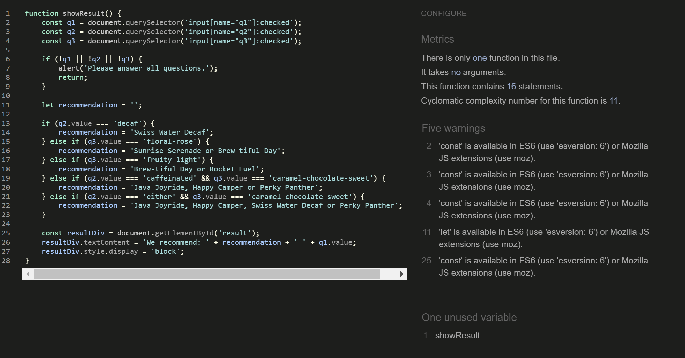

# WellGood Coffee Testing

[View the live project here.](https://wellgood-coffee-f56fcdb787d6.herokuapp.com/)

As with any project, I have been rigorously testing throughout the development process of this web application. I have documented my testing strategy that I planned before I started developing, as well as main bugs that arose whilst developing and how I approached fixing them. I have also tested my web app on different devices and asked family and friends to use and give feedback as to how to improve user experience and inform me of any bugs spotted during use.

With the scale of this project in the grand scheme of things being quite small, automated testing with softwares like Jest or Pytest, for Javascript and Python respectively in this instance it has not been necessary, but I undestand with larger projects with more extensive functions, that this would be useful and essential. I am keen to use Jest and Pytest in future larger projects.

I have applied what I have learned about Test Driven Development into my project and documented some examples of where I have used it in this file.

I have used a mixture of manual and automated testing while developing, both of which play a key role in forming a web application that works correctly and consistently. Automated testing can be great for doing quick overview results, for example checking code compliant with style guides etc., especially with more extensive projects and applications. Manual testing has allowed me to look at things at a deeper level, checking things like user experience design and in turn finding areas for improvement to strengthen my application as a whole. Using both has allowed me to build reliable functions and code and a higher quality end product.

# Table of Contents

1. [Automated Testing](#automated-testing)
2. [Test Driven Development](#test-driven-development)
3. [Manual Testing](#manual-testing)

# AUTOMATED TESTING

## HTML Validator - [W3C](https://validator.w3.org/)

I put every template page in my site into the HTML validator. This was useful to highlight some code errors that I had missed looking through manually.

### Home Page

#### Before

#### After updates

### Coffee Quiz

#### Before

#### After updates

### Product List Page

### Product Detail Page

### About Page

#### Before

#### After updates

### Contact Page

#### Before

#### After updates

### Profile Page

The validator would not work for the deployed link of this page, saying it was not retreiveable. This will be due to the fact that the profile only loads when a session cookie is in place from a user login, so it would not be able to render in the validator. To work around this I added the raw code into the validator, and checked through for any justified errors. The validator, due to the fact the raw code has templating code in it that refers to the base.html for the header etc., as well as having python language in it, it was throwing alot of irrelevant errors, as you can see below. I checked each of them one by one, and none were justified errors that required changes.

### Product Management Page / Add Product Page

The validator highlighted:
* __Warning:__ 

### Edit Product Page

### Sign In Page

### Sign Out Page

### Register Page

### Checkout Page

### Bag Page

## CSS Validator - [W3C](https://jigsaw.w3.org/css-validator/)

No errors were found in my CSS code when put through the validator.

## JSHint Validator - [JSHint](https://jshint.com/)

### Product.js
* __Warning:__ 

### Countryfield.js
* __Warning:__ 

### Quiz.js
* __Warning:__ 

## Python Validator - [Code Institute Python Linter](https://pep8ci.herokuapp.com/)

After one final code tidy up, I validated all python code that isn't automatically generated, with the Code Institute Python Linter and returned no errors bar the views.py file below for the Home app, which I have amended accordingly.

### views.py file

## Lighthouse

To test performance and accessibility, I used Lighthouse within the Chrome Developer Tools. I improved my Accessibility in particular by making sure I had included meta tags and data and that all relevant objects had alt tags and aria labels.

| Page | Results |
| --- | --- |
| Home Page |  |
| About Page |  |
| Login Page |  |
| Register Page |  |
| Quiz Page |  |
| Profile Page |  |
| Contact Page |  |
| Product Management Page |   The accessibility score was lower on this page due to it wanting to see aria labels on certain form inputs. Unfortunately, these particular inputs were crispy form inputs generated so I was not able to rectify this in this particular instance.|
| Edit Product Page |  |
| Product List Page |  Before - To improve my scores I removed an unneccessary aria-label and did a sitewide compression of all images  After|
| Product Detail Page |  Before - To improve my scores I removed an unneccessary aria-label and did a sitewide compression of all images  After|
| Checkout Page |  |
| Bag Page |  |
| Performance issues |  Most pages had a performance score of 85-90 due to the issues above, which has been down to the fact that the site is calling to alot of external sources to load, coupled with the framework meaning that again code is being sourced from numerous files to formulate a singular page. Given more time I would look into this issue further as a future improvement. Compressing the images on the site did improve load time and performance slightly.|

# TEST DRIVEN DEVELOPMENT

# MANUAL TESTING

## Testing User Stories

<table>
  <thead>
    <tr>
      <th>As a...</th>
      <th>Goal</th>
      <th>How is it acheived</th>
      <th>Image</th>
    </tr>
    <tr>
      <th colspan="4">Viewing and Navigation</th>
    </tr>
  </thead>
  <tbody>
    <tr>
      <td>Visitor</td>
      <td>Clearly identify the purpose of the site</td>
      <td>Big coffee hero image on landing page with 'shop now' call to action</td>
      <td></td>
    </tr>
    <tr>
      <td>Shopper</td>
      <td>View a list of products</td>
      <td>Selection of categories available for shopper to click on in navbar for easy access straight to lists of products</td>
      <td></td>
    </tr>
    <tr>
      <td>Shopper</td>
      <td>Take a coffee quiz</td>
      <td>Link to coffee quiz in nav bar for quick access</td>
      <td></td>
    </tr>
    <tr>
      <td>Shopper</td>
      <td>View individual product details</td>
      <td>Click on a product to view all details on product detail page</td>
      <td></td>
    </tr>
    <tr>
      <td>Shopper</td>
      <td>Easily view my basket total spend at any time</td>
      <td>The bag total is visible in the top right hand corner of the screen at all times</td>
      <td></td>
    </tr>
    <tr>
      <td>Shopper</td>
      <td>Easily view my postage total</td>
      <td>Delivery total can be seen on the bag page</td>
      <td></td>
    </tr>
    </tbody>
    <thead>
    <tr>
      <th colspan="4">Registration and User Accounts</th>
    </tr>
    </thead>
    <tbody>
    <tr>
      <td>New visitor</td>
      <td>Register for an account</td>
      <td>To have all orders and profile information in one place for future purchases</td>
    </tr>
    <tr>
      <td>Registered User</td>
      <td>Login or logout</td>
      <td>Access my personal account information and previous purchases</td>
    </tr>
    <tr>
      <td>Registered User</td>
      <td>Reset my password in case I forget it</td>
      <td>Recover access to my account</td>
    </tr>
    <tr>
      <td>Registered User</td>
      <td>Receive an email confirmation after registering</td>
      <td>Verify that my account registration was successful</td>
    </tr>
    <tr>
      <td>Registered User</td>
      <td>Have a personalised user profile</td>
      <td>View my personal order history and order confirmation, and save my payment information</td>
    </tr>
    <tr>
      <td>Registered User</td>
      <td>Have my email address verified by the site</td>
      <td>Ensure my email address and personal data are safe and secure</td>
    </tr>
    <tr>
      <td>Registered User</td>
      <td>See my past order history</td>
      <td>Make repeat orders</td>
    </tr>
    </tbody>
    <thead>
    <tr>
      <th colspan="3">Sorting and Searching</th>
    </tr>
    </thead>
    <tbody>
    <tr>
      <td>Shopper</td>
      <td>Sort the list of available products</td>
      <td>Easily identify the best rated, best priced and categorically sorted products</td>
    </tr>
    <tr>
      <td>Shopper</td>
      <td>Sort a specific category of product</td>
      <td>Find the best priced or best rated product in a specific category, or sort the products in that category by name</td>
    </tr>
    <tr>
      <td>Shopper</td>
      <td>Sort multiple categories of products simultaneously</td>
      <td>Find all associated equipment linked to a word search</td>
    </tr>
    <tr>
      <td>Shopper</td>
      <td>Search for a product by name or description</td>
      <td>Find a specific product I would like to purchase</td>
    </tr>
    <tr>
      <td>Shopper</td>
      <td>Easily see what I've searched for and the number of results</td>
      <td>Quickly decide whether the product I want is available</td>
    </tr>
    <tr>
      <td>Shopper</td>
      <td>Save my billing and shipping details</td>
      <td>Checkout even quicker and more conveniently on future orders</td>
    </tr>
    </tbody>
    <thead>
    <tr>
      <th colspan="3">Purchasing and Checkout</th>
    </tr>
    </thead>
    <tbody>
    <tr>
      <td>Shopper</td>
      <td>Easily select the size, grind type and quantity of a coffee when purchasing it</td>
      <td>Ensure I don't accidentally select the wrong product, quantity, grind type or size</td>
    </tr>
    <tr>
      <td>Shopper</td>
      <td>View items in my bag to be purchased</td>
      <td>Identify the total cost of my purchase and all items I will receive</td>
    </tr>
    <tr>
      <td>Shopper</td>
      <td>View the total cost of my purchase before checking out</td>
      <td>So that I can see what the total cost of my purchase is including any additional costs such as shipping are before making my final purchase</td>
    </tr>
    <tr>
      <td>Shopper</td>
      <td>Adjust the quantity of individual items in my bag</td>
      <td>Easily make changes to my purchase before checkout</td>
    </tr>
        <tr>
      <td>Shopper</td>
      <td>Remove items in my bag</td>
      <td>Easily make changes to my purchase before checkout</td>
    </tr>
    <tr>
      <td>Shopper</td>
      <td>Easily enter my payment information</td>
      <td>Check out quickly with no hassles</td>
    </tr>
    <tr>
      <td>Shopper</td>
      <td>Feel my personal and payment information is safe and secure</td>
      <td>Confidently product the needed information to make a purchase</td>
    </tr>
    <tr>
      <td>Shopper</td>
      <td>View an order confirmation at checkout</td>
      <td>Verify that I haven't made any mistakes</td>
    </tr>
    <tr>
      <td>Shopper</td>
      <td>Receive an email confirmation after checking out</td>
      <td>Keep the confirmation of what I've purchase for my records</td>
    </tr>
    <tr>
      <td>Shopper</td>
      <td>Contact the store easily with any questions or concerns</td>
      <td>Get further information about a product or purchase</td>
    </tr>
    <tr>
      <td>Shopper</td>
      <td>See at a glance if there are any items in my shopping basket</td>
      <td>See quickly at a glance if there are any items already in my basket</td>
    </tr>
    <tr>
      <td>Shopper</td>
      <td>See how much I need to spend to qualify for free shipping</td>
      <td>Ensure I am getting the best value on potentially larger purchases</td>
    </tr>
    <tr>
      <td>Shopper</td>
      <td>Be able to checkout without registering for an account</td>
      <td>Checkout quickly and easily even if I don't want to register for an account with the store</td>
    </tr>
    </tbody>
    <thead>
    <tr>
      <th colspan="3">Admin and Store Management</th>
    </tr>
    </thead>
    <tbody>
    <tr>
      <td>Store Owner/Staff Member</td>
      <td>Add a product</td>
      <td>Add new items to my store</td>
    </tr>
    <tr>
      <td>Store Owner/Staff Member</td>
      <td>Edit/Update a product</td>
      <td>Change product prices, descriptions, images and other product criteria</td>
    </tr>
    <tr>
      <td>Store Owner/Staff Member</td>
      <td>Delete a product</td>
      <td>Remove items that are no longer for sale</td>
    </tr>
    <tr>
      <td>Store Owner/Staff Member</td>
      <td>Manage Stock levels</td>
      <td>Keep track of available inventory</td>
    </tr>
  </tbody>
</table>

## Devices Used For Testing

I have asked friends and family to test the site on their devices. This app has been tested on the following:

Poco X3 NFC - Chrome
Iphone 10 - Firefox
Ipad Pro - Safari
Huawei Matebook Pro - Microsoft Edge and Chrome
Google Pixel - Chrome

## Full Manual Testing

### Home
| Feature/Action | Expected Outcome | Testing Performed | Result | Pass/Fail |
| --- | --- | --- | --- | --- |
| Login button | User is redirected to the Login page when clicked | Clicked Login button | Redirected to the login page | Pass |

### Quiz
| Feature/Action | Expected Outcome | Testing Performed | Result | Pass/Fail |
| --- | --- | --- | --- | --- |
| Login with correct credentials | User is redirected to the their profile with a flash message at the top of the page that says 'Welcome "Username"' | Used correct credentials in input fields | Redirected to the profile and flash message appeared | Pass |

### Products List
| Feature/Action | Expected Outcome | Testing Performed | Result | Pass/Fail |
| --- | --- | --- | --- | --- |
| Register with incorrect username format | It stays on the register page and a validation message appears asking them to match the required format. | Entered a username below 5 characters, over 15 characters and with special characters. | Validation message appeared | Pass |

### Product Detail
| Feature/Action | Expected Outcome | Testing Performed | Result | Pass/Fail |
| --- | --- | --- | --- | --- |
| Select a meal type filter dropdown option | Should filter recipes to show only recipes that match the meal type and selection remain visible in the dropdown | Selected each of the dropdown options to view recipes filtered for each | Recipes filtered successfully and selection remained visible in dropdown | Pass |

### About
| Feature/Action | Expected Outcome | Testing Performed | Result | Pass/Fail |
| --- | --- | --- | --- | --- |
| Select a meal type filter dropdown option | Should filter recipes to show only recipes that match the meal type and selection remain visible in the dropdown | Selected each of the dropdown options to view recipes filtered for each | Recipes filtered successfully and selection remained visible in dropdown | Pass |

### Contact
| Feature/Action | Expected Outcome | Testing Performed | Result | Pass/Fail |
| --- | --- | --- | --- | --- |
| Input first name with over 30 characters | Should not be possible, after 30 characters, characters typed will not appear | Tried to input more than 30 characters | No characters typed over 30 characters appear | Pass |

### Login
| Feature/Action | Expected Outcome | Testing Performed | Result | Pass/Fail |
| --- | --- | --- | --- | --- |
| Input first name with over 30 characters | Should not be possible, after 30 characters, characters typed will not appear | Tried to input more than 30 characters | No characters typed over 30 characters appear | Pass |

### Register
| Feature/Action | Expected Outcome | Testing Performed | Result | Pass/Fail |
| --- | --- | --- | --- | --- |
| Input first name with over 30 characters | Should not be possible, after 30 characters, characters typed will not appear | Tried to input more than 30 characters | No characters typed over 30 characters appear | Pass |

### Thank you
| Feature/Action | Expected Outcome | Testing Performed | Result | Pass/Fail |
| --- | --- | --- | --- | --- |
| Redirect countdown | Redirect to the home page after 5 second countdown | Load the thank you page | Redirected to home page successfully after 5 seconds | Pass |

### Profile
| Feature/Action | Expected Outcome | Testing Performed | Result | Pass/Fail |
| --- | --- | --- | --- | --- |
| Add Product button | Redirect to add Product page | Click add Product button | Redirected to add Product page successfully | Pass |

### Product Management
| Feature/Action | Expected Outcome | Testing Performed | Result | Pass/Fail |
| --- | --- | --- | --- | --- |
| Add Recipe button | Redirect to add recipe page | Click add recipe button | Redirected to add recipe page successfully | Pass |
| Back to Products button | Redirect to profile page | Click back to Products button | Redirected to profile page successfully | Pass |
| Collapsed recipe | Should open to display recipe info when clicked | Click recipe title | Recipe info appeared correctly | Pass |

### Edit Product
| Feature/Action | Expected Outcome | Testing Performed | Result | Pass/Fail |
| --- | --- | --- | --- | --- |
| Pre-populated input field | Previously saved Product name to pre-populate the input field | Direct to the edit Product page from profile | Previously saved Product name was pre-populated into the input field, ready for editing | Pass |

### Checkout
| Feature/Action | Expected Outcome | Testing Performed | Result | Pass/Fail |
| --- | --- | --- | --- | --- |
| Input fields left empty when form submitted | Validation message to appear "Please fill in this field" | Submit the form with each input left empty on their own | Each input had the validation message appear as expected | Pass |

### Bag
| Feature/Action | Expected Outcome | Testing Performed | Result | Pass/Fail |
| --- | --- | --- | --- | --- |
| Pre-populated input field | Previously saved recipe inputs to pre-populate the input field | Direct to the edit recipe page from profile | Previously saved recipe info was pre-populated into the input field, ready for editing | Pass |

### 404 Page
| Feature/Action | Expected Outcome | Testing Performed | Result | Pass/Fail |
| --- | --- | --- | --- | --- |
| User tries to access an incorrect URL or page cannot cannot be found | User is redirected to the 404 page with a message displayed "Sorry this page doesn't exist", with a button linked to the Home page. | Typed an incorrect URL into address bar | Not redirected to custom 404 page. | Fail |

### Log out
| Feature/Action | Expected Outcome | Testing Performed | Result | Pass/Fail |
| --- | --- | --- | --- | --- |
| User logs out using log out link in nav bar | User is redirected to login page with a message displayed "You have been logged out", and the link disappears from the nav bar, replaced by Login and Register | Click on log out link | Redirected successfully to login page with a message displayed "You have been logged out", and the link disappears from the nav bar. Register and Login reappear as links in nav bar. | Pass |

### Footer
| Feature/Action | Expected Outcome | Testing Performed | Result | Pass/Fail |
| --- | --- | --- | --- | --- |
| Links change when logged in | User logs in and links change from 'Login, Register and Contact' to 'profile, Logout, Contact' | Login to registered user accunt | Links changed from 'Login, Register and Contact' to 'profile, Logout, Contact' | Pass |

### Nav Bar
| Feature/Action | Expected Outcome | Testing Performed | Result | Pass/Fail |
| --- | --- | --- | --- | --- |
| Input first name with over 30 characters | Should not be possible, after 30 characters, characters typed will not appear | Tried to input more than 30 characters | No characters typed over 30 characters appear | Pass |

## Bugs

### Solved Bugs

| No. | Bug | How I solved the issue |
| --- | --- | --- |
| 1. | Pre-populated dropdown options not working in the Edit Recipe form. | Removed ‘selected’ from options.  |
| 2. | Contact form submit button triggering a new window to open Thank you page rather than just redirect. | Changed from 'window.open' to 'window.location.replace' in function.  |
| 3. | Mobile side nav not working. | Code was missing a closing bracket, so added to fix.  |
| 4. | Product dropdown on add recipe and edit recipe pages showing all Products on database, not just specific user's Products. | I updated the app routes to include user queries and update the render template to call just the user's Products. |
| 5. | Recipe Ingredients and Instructions displaying as one full line without breaks on recipes page and search page. | Searched solutions and found this to add to breaks to the code [Line Breaks Solutions](https://stackoverflow.com/questions/3206344/passing-html-to-template-using-flask-jinja2) |
| 6. | If dropdowns on Add and edit recipe pages not selected, no validation message appearing | Inspecting the dropdowns in google dev tools I spotted that materialize adds a "display:none" to dropdowns, which removes the usual validation messages. I searched for a solution and found this 'select' code snippet [Dropdown solution](https://stackoverflow.com/questions/34248898/how-to-validate-select-option-for-a-materialize-dropdown ) to remove the materialize CSS on it so that the validation now shows again. Given this issue, I intend on using Materialize alternatives in future to avoid this issue. |
| 7. | Custom 404 page not appearing when incorrect URLs are created | Needed to change the app route to '@app.errorhandler(404)' [Custom 404 app route solution](https://stackoverflow.com/questions/73140435/why-custom-404-page-not-working-with-flask) |
| 8. | White space appearing below nav bar on index page | I found this happened after I changed the search icon from a materialize icon to a font awesome icon. I tested different sizes but the white space remained, so I reverted back to the materialize icons for the menu and nav bar icons used to avoid this issue. |

### Unsolved Bugs

None known at this time.
drop down for syrups sizes